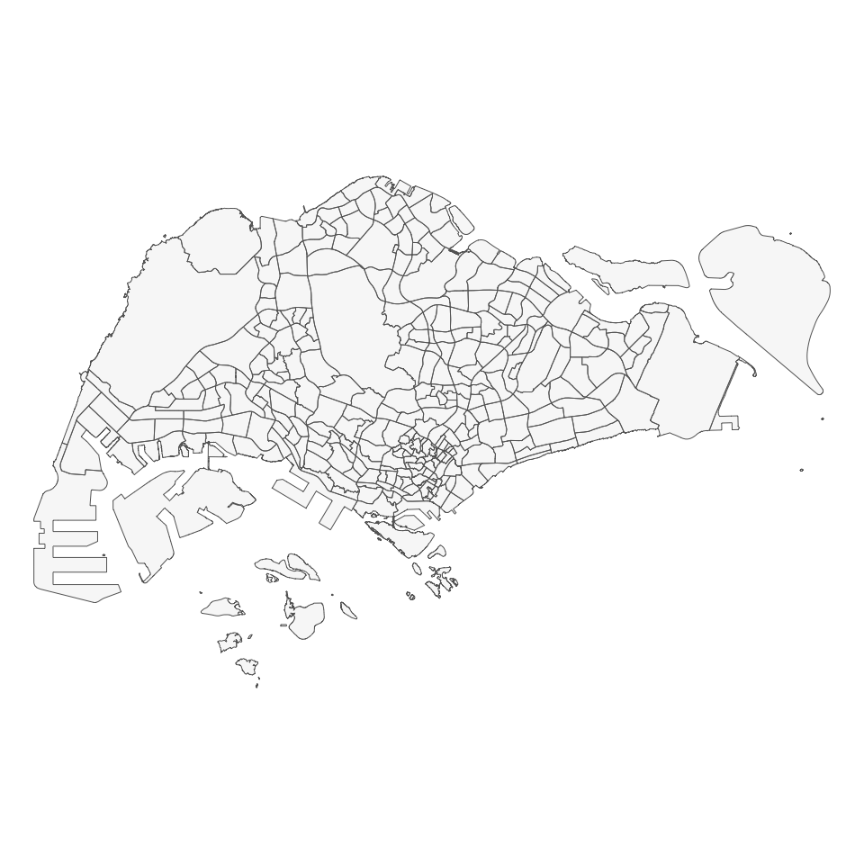
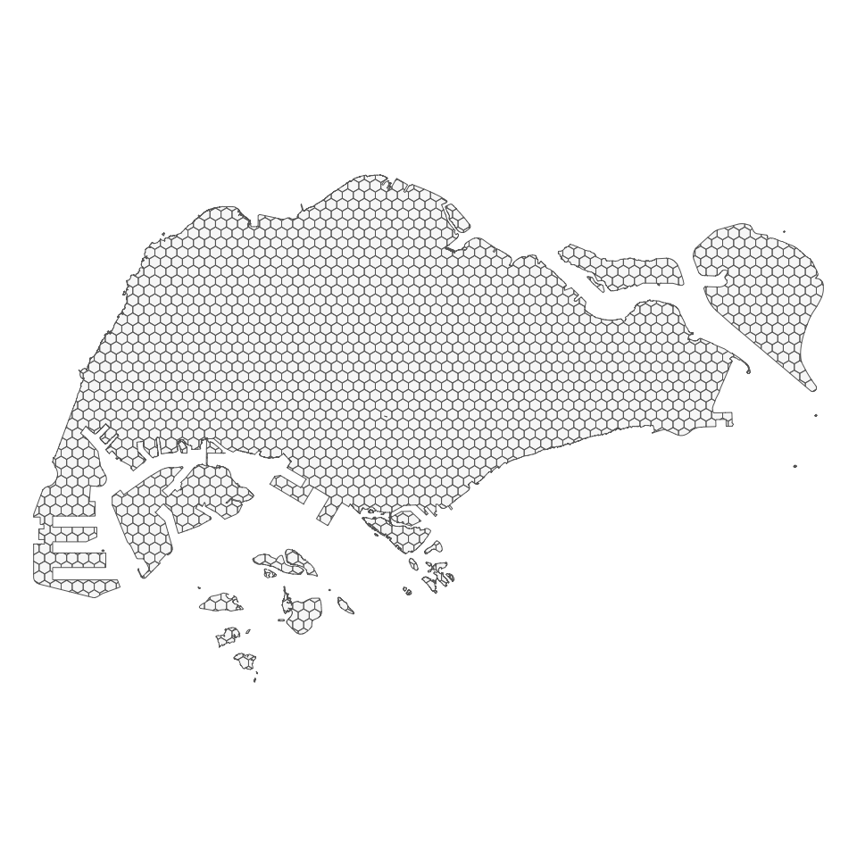
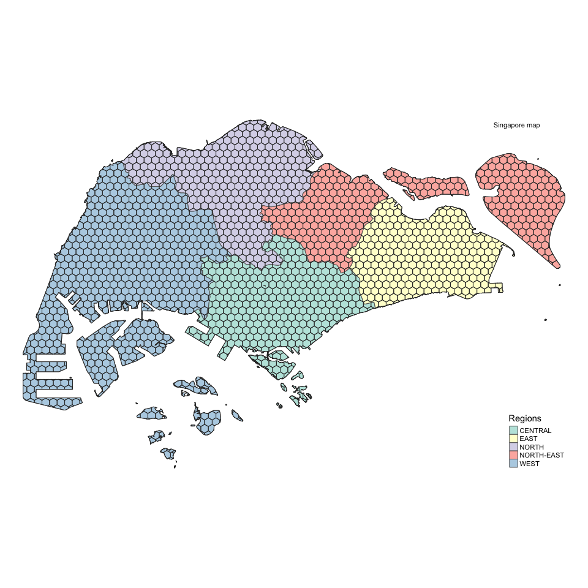

Spatial aggregation: create hexagonal grids
================
Qingqing Chen
Last compiled date: 17 September, 2021

### Load Singapore boundary

``` r
sg_subzone <- read_sf(here("data/raw_data/sg-subzone/MP14_SUBZONE_NO_SEA_PL.shp"), quiet = T) %>% 
  st_transform(crs = 3414) %>% 
  st_make_valid()
tm_shape(sg_subzone) + 
  tm_polygons(alpha = 0.2) +
  tm_layout(frame = F) 
```



### Aggregated to hexgonal grids

``` r
# assign the spatial unit size to cellsize argument, here we use 750m
# and transform coordinates of simple feature to Singapore: https://epsg.io/3414
set.seed(1314)
grids <- st_make_grid(sg_subzone, cellsize = 750, square = F) %>% 
  st_sf() %>% 
  rowid_to_column("grid_id") %>% 
  st_transform(crs = 3414) %>% 
  st_intersection(sg_subzone) %>% 
  select(grid_id) %>% 
  group_by(grid_id) %>% 
  summarise()
tm_shape(grids) + 
  tm_polygons(alpha = 0.2) +
  tm_layout(frame = F) 
```



The created grid cells can be saved under `data/derived_data/`
directory.

``` r
st_write(grids, here("data/derived_data/spatial_hex_grid.shp"), quiet = T)
```

``` r
sg_subzone %>% 
  group_by(REGION_N) %>% 
  summarise() %>% 
  mutate(REGION_N = gsub(" REGION", "", REGION_N)) %>% 
  dplyr::rename(Regions = REGION_N) %>% 
  tm_shape() + 
  tm_polygons(col = "Regions", alpha = 0.6) + 
  tm_shape(grids) + 
  tm_borders(col = "grey20") + 
  tm_layout(frame = F) + 
  tm_credits("Singapore map", position = c(0.85, 0.95))
```


