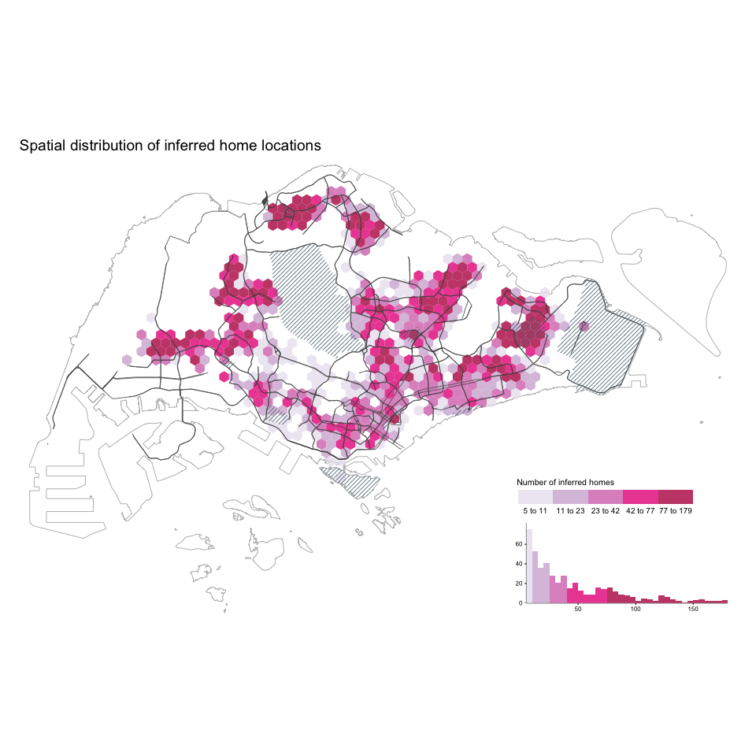
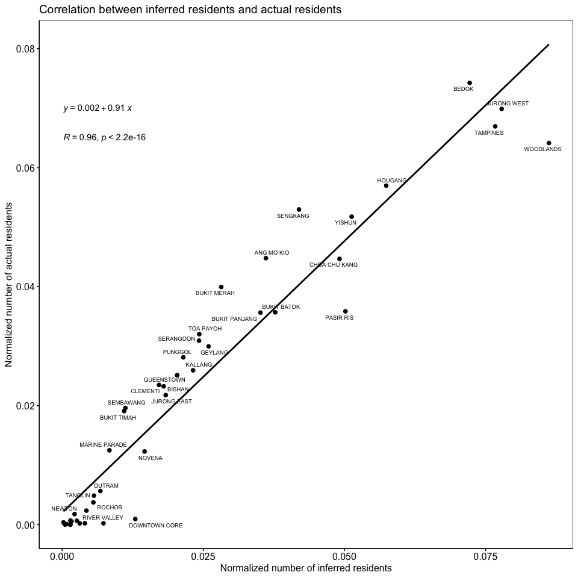

Identifying home locations for users
================
Qingqing Chen
Last compiled date: 18 September, 2021

<style>
body {text-align: justify}
</style>

To identify home locations for users from their spatio-temporal
footprints, we use an ensemble approach proposed by Chen and Poorthuis
(2021) in their paper named [“*Identifying Home Locations in Human
Mobility Data: An Open-Source r Package for Comparison and
Reproducibility*”](https://www.tandfonline.com/doi/abs/10.1080/13658816.2021.1887489).
The introduced open-source R package,
[homelocator](https://github.com/spatialnetworkslab/homelocator),
provides a consistent framework and interface for the adoption of
different approaches to home location identification.

First, we need to install and load the `homelocator` package with:

``` r
install_github("spatialnetworkslab/homelocator")
library(homelocator)
```

## Load data

``` r
# grid cells 
grids <- st_read(here("data/derived_data/spatial_hex_grid.shp"), quiet = T) %>%
  st_transform(crs = 3414)
```

``` r
# de-identified tweets 
df <- read_csv(here("data/raw_data/deidentified_sg_tweets.csv")) %>% #load de-identified dataset
  mutate(created_at = with_tz(created_at, tzone = "Asia/Singapore")) # the tweets were sent in Singapore, so must convert the timezone to SGT, the default timezone is UTC! 
df_counts <- df %>% 
  group_by(u_id) %>% 
  nest() %>% 
  mutate(n_tweets = map_dbl(data, nrow), 
         n_locs = map_dbl(data, function(x) n_distinct(x$grid_id)))
df <- df_counts %>% 
  filter(n_tweets >= 10 & n_locs > 1) %>% # remove users with less than 10 tweets or only tweet at a single place
  unnest(data) %>% 
  dplyr::select(-c(n_tweets, n_locs)) %>% 
  ungroup()
```

The updated de-identified dataset is in `analysis/data/derived_data`.

``` r
saveRDS(df, file = here("data/derived_data/deidentified_sg_tweets_updated.rds"))
```

## Identify home locations

Finally, we apply the four built-in recipes from `homelocator` package
on the de-identified data set and only assign home location for users if
four algorithms agree.

### Recipe: APDM

Recipe ‘APDM’ (Rein Ahas et al., 2010) calculates both the average and
standard deviation timestamps in each location for each user.

``` r
#generate grid neighbors 
st_queen <- function(a, b = a) st_relate(a, b, pattern = "F***T****")
neighbors <- st_queen(grids)

#convert list to tibble
list_to_tibble <- function(index, neighbors){
  tibble(grid_id = as.character(index)) %>% 
    mutate(neighbor = list(neighbors[[index]]))
}
df_neighbors <- do.call(rbind, map(1:length(neighbors), function(x) list_to_tibble(x, neighbors)))

#recipe: APDM
hm_apdm <- homelocator::identify_location(df, user = "u_id", timestamp = "created_at", location = "grid_id", 
                             tz = "Asia/Singapore", keep_score = F, recipe = "APDM")
```

### Recipe: FREQ

Recipe ‘FREQ’ simply selects the most frequently ‘visited’ location as
users’ home locations.

``` r
hm_freq <- homelocator::identify_location(df, user = "u_id", timestamp = "created_at", location = "grid_id", 
                             tz = "Asia/Singapore", show_n_loc = 1, recipe = "FREQ")
```

### Recipe: HMLC

Recipe ‘HMLC’ weighs data points across multiple time frames to ‘score’
potentially meaningful locations.

``` r
hm_hmlc <- homelocator::identify_location(df, user = "u_id", timestamp = "created_at", location = "grid_id", 
                             tz = "Asia/Singapore", show_n_loc = 1, keep_score = F, recipe = "HMLC")
```

### Recipe: OSNA

Recipe ‘OSNA’ (Efstathiades et al., 2015), only considers data points
sent on weekdays and divides a day into three time frames - ‘rest time’,
‘leisure time’ and ‘active time’. The algorithm finds the most ‘popular’
location during ‘rest’ and ‘leisure’ time as the home locations for
users.

``` r
hm_osna <- homelocator::identify_location(df, user = "u_id", timestamp = "created_at", location = "grid_id", 
                             tz = "Asia/Singapore", show_n_loc = 1, recipe = "OSNA")
```

The identified homes are in `data/derived_data`.

``` r
write_csv(hm_apdm, path = here("data/derived_data/hm_apdm.csv"))
write_csv(hm_freq, path = here("data/derived_data/hm_freq.csv"))
write_csv(hm_hmlc, path = here("data/derived_data/hm_hmlc.csv"))
write_csv(hm_osna, path = here("data/derived_data/hm_osna.csv"))
```

### Assign agreed home locations for users

``` r
## find users with identified home locations that all four algorithms agree
qualified_uses <- hm_full %>% 
      group_by(u_id) %>%
      dplyr::summarise(method = dplyr::n_distinct(name),
                       homes = dplyr::n_distinct(home)) %>%
      filter(method == 4) %>% ## all four algorithms can find the home for the user 
      filter(homes == 1) ## all four algorithms find the SAME home for the user 

identified_hms <- hm_full %>% 
  filter(u_id %in% qualified_uses$u_id) %>% 
  dplyr::select(-name) %>% 
  distinct(u_id, home, .keep_all = TRUE) 
```

The identified home locations are saved under `data/derived_data/`
directory.

``` r
write_csv(identified_hms, path = here("data/derived_data/identified_hms.csv"))
```

## Visualize identified home locations

``` r
identified_hms <- read_csv(here("data/derived_data/identified_hms.csv")) %>% 
  group_by(home) %>% 
  dplyr::summarise(n_users_home = n_distinct(u_id)) %>% 
  left_join(., grids, by = c("home" = "grid_id")) %>% 
  replace(., is.na(.), 0) %>% 
  st_as_sf() 
```

``` r
sg_boundary <- readRDS(here("data/derived_data/sg_boundary.rds"))
streets <- readRDS(here("data/derived_data/streets.rds"))
area_hatched <- readRDS(here("data/derived_data/area_hatched.rds"))
area_centers <- readRDS(here("data/derived_data/area_centers.rds"))

tm_shape(sg_boundary) +
  tm_borders(col = "grey") + 
  tm_shape(identified_hms) +
    tm_fill("n_users_home",
            palette = "PuRd",
            style = "quantile",
            alpha = 0.8,
            legend.is.portrait = F,
            legend.format = list(digits = 0),
            legend.hist = TRUE,
            title = "Number of inferred homes") + 
  tm_shape(streets) +
  tm_lines(col = rgb(80, 80, 80, maxColorValue = 255), lwd = 1, alpha = 0.8) +
  tm_shape(area_hatched) + 
  tm_lines(col = rgb(80, 110, 120, maxColorValue = 255), alpha = 0.8) +
  tm_layout(title.position = c("left", "top"),
            title.size = 0.7,
            main.title = "Spatial distribution of inferred home locations",
            main.title.size = 1.2,
            frame = F,
            legend.position = c("right", "bottom"),
            legend.bg.color = "white",
            legend.width = 0.3,
            legend.title.size  = 0.8,
            legend.text.size = 0.66,
            legend.hist.height = 0.2,
            legend.hist.width = 0.3,
            legend.hist.size = 0.5)
```

<!-- -->

``` r
#residents in Singapore 2015
pop2015 <- st_read(here("data/raw_data/PLAN_BDY_DWELLING_TYPE_2015.shp"), quiet = T) %>%
  st_transform(., crs = 3414) %>% 
  st_make_valid()

inferred_residents <- pop2015 %>% 
  dplyr::select(PLN_AREA_N) %>% 
  st_join(identified_hms, ., largest = T) %>% 
  st_set_geometry(NULL) %>% 
  group_by(PLN_AREA_N) %>% 
  dplyr::summarise(n_inferred_residents = sum(n_users_home))

actual_residents <- pop2015 %>% 
  st_set_geometry(NULL) %>% 
  select(c(PLN_AREA_N, TOTAL))

norm_residents <- left_join(inferred_residents, actual_residents) %>% 
  mutate(norm_n_inferred_residents = n_inferred_residents/sum(n_inferred_residents),
         norm_n_actual_residents = TOTAL/sum(TOTAL))


ggscatter(norm_residents, x = "norm_n_inferred_residents", y = "norm_n_actual_residents",
          add = "reg.line") +
  stat_cor(label.y = 0.065) +
  stat_regline_equation(label.y = 0.07) + 
  ggrepel::geom_text_repel(aes(label=PLN_AREA_N), size = 2.5) +
  theme(panel.background=element_rect(fill = "white", colour = "black"), 
        title = element_text(size = 12)) + 
  labs(x = "Normalized number of inferred residents",
       y = "Normalized number of actual residents", 
       title = "Correlation between inferred residents and actual residents") 
```

<!-- -->

## Reference

<div id="refs" class="references csl-bib-body hanging-indent">

<div id="ref-homelocator" class="csl-entry">

Chen, Q. and Poorthuis, A. 2021. *Identifying Home Locations in Human
Mobility Data: An Open-Source r Package for Comparison and
Reproducibility*. *International Journal of Geographical Information
Science, 0(0), Pp. 1–24.*
<https://doi.org/10.1080/13658816.2021.1887489>.

</div>

</div>
