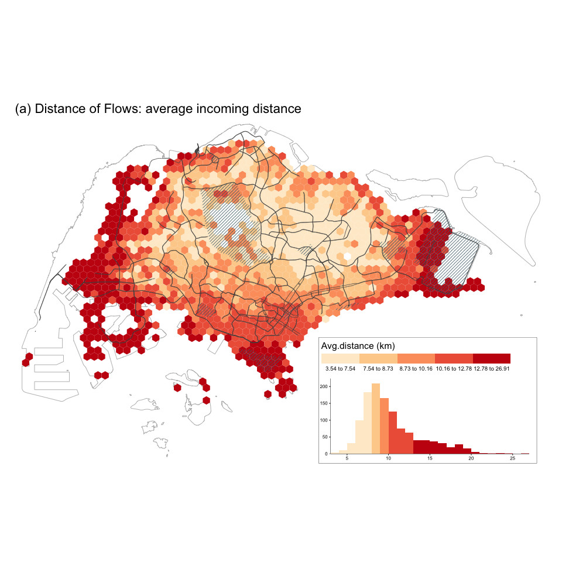
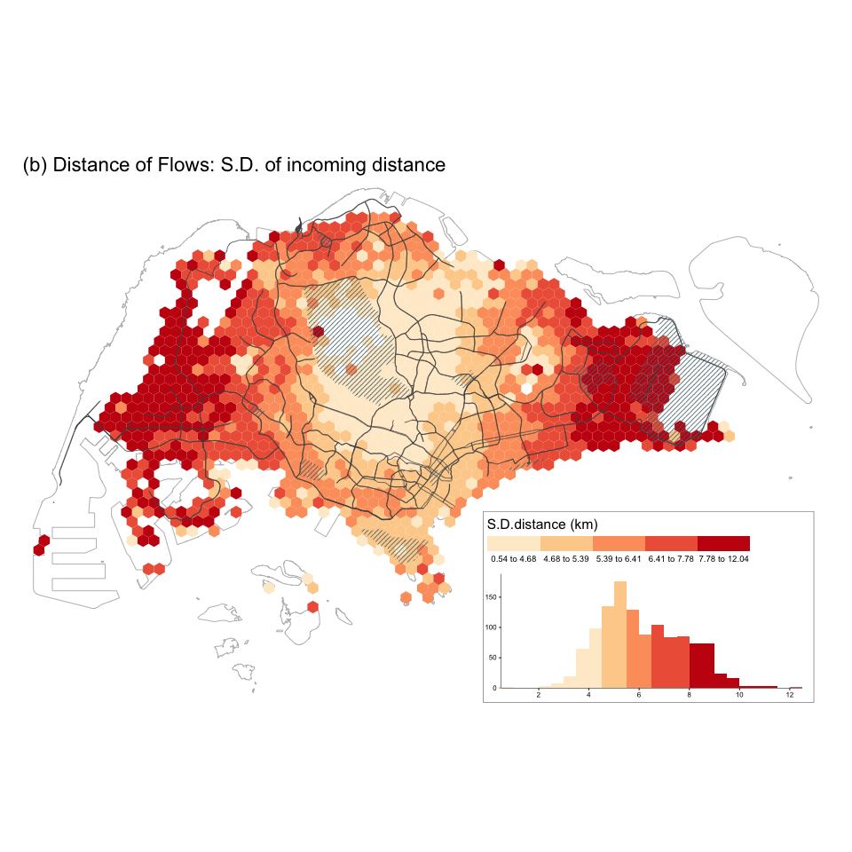
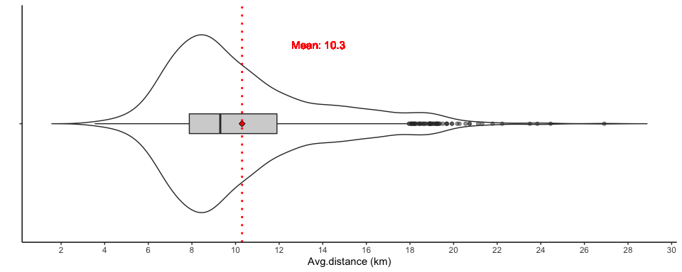
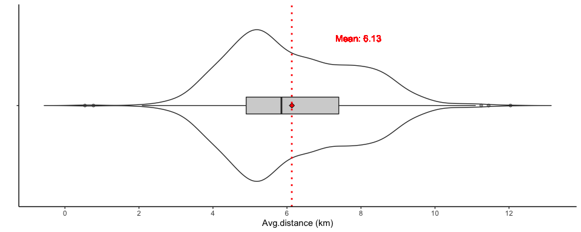
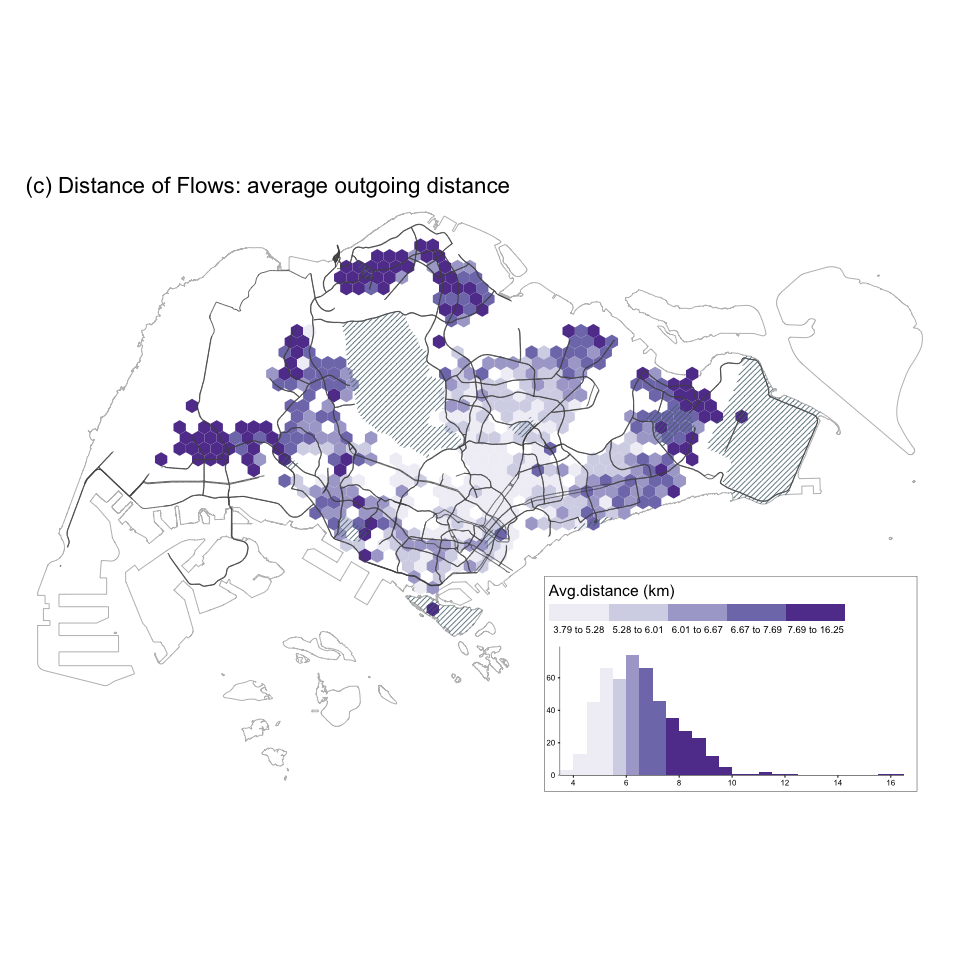
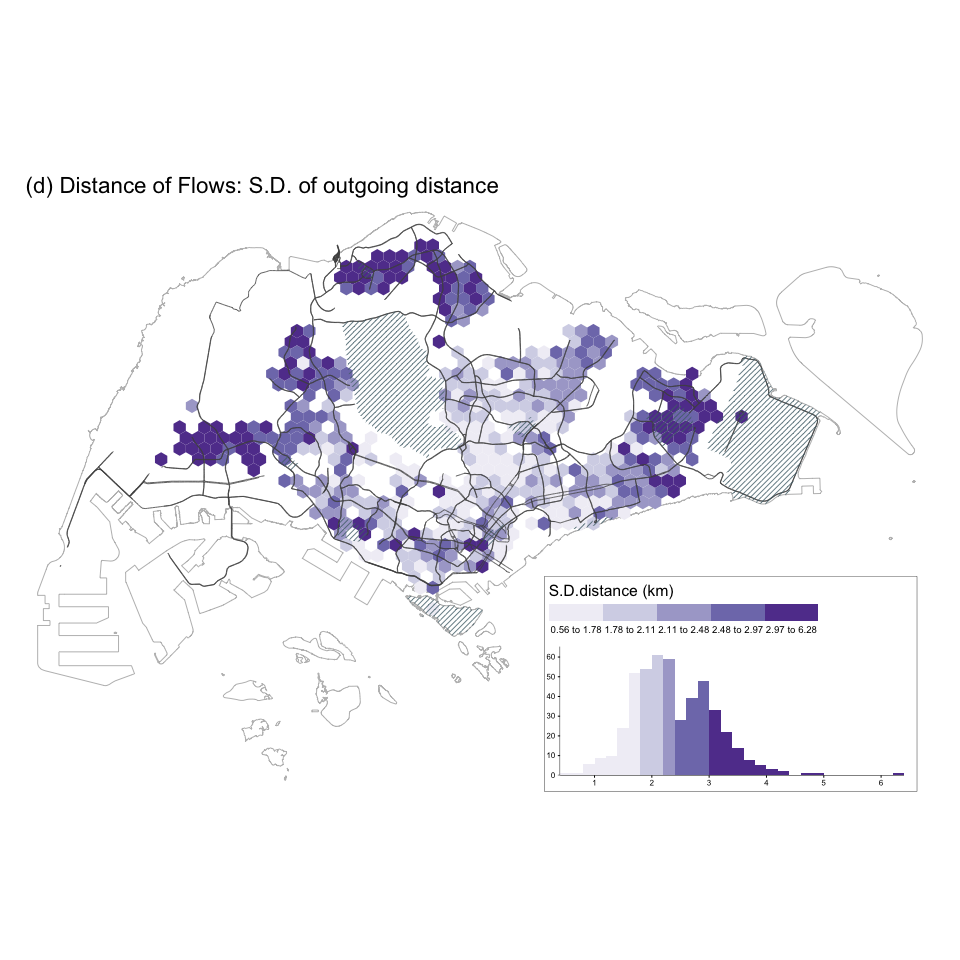
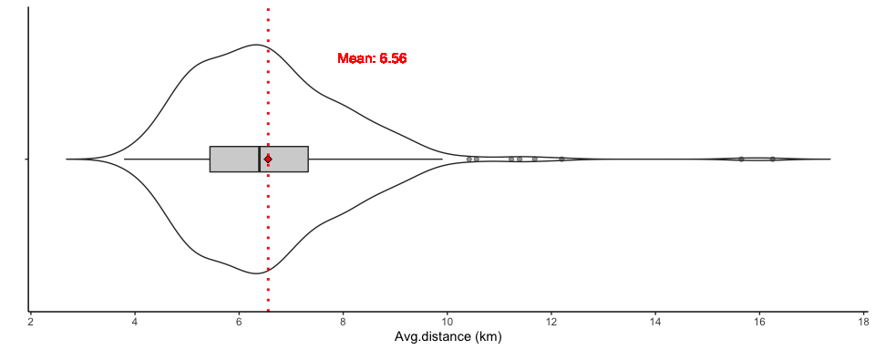
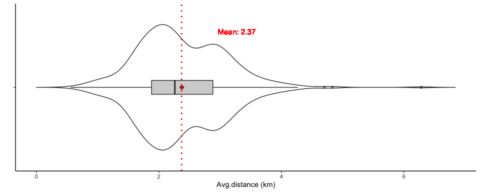

Distance of flows
================
Qingqing Chen
Last compiled date: 18 September, 2021

<style>
body {text-align: justify}
</style>

We calculate the spatial distance from the centroid of a home location
to the centroid of each visited location. The mean distance across all
users in a location is used for the visualizations and the spatial
regression modeling in the paper.

## Load data

``` r
# full grids 
grids <- read_sf(here("data/derived_data/spatial_hex_grid.shp"), quiet = T) %>%
  st_transform(crs = 3414)

# grid centroids 
grid_centroids <- grids %>% st_centroid()

# identified home users 
df_hms <- read_csv(here("data/derived_data/identified_hms.csv"))

# sg tweets 
df_tweets <- readRDS(here("data/derived_data/deidentified_sg_tweets_updated.rds"))
## sg tweets sent by users with identified home locations 
df_hm_tweets <- df_tweets %>% filter(u_id %in% df_hms$u_id)

# distinct users 
distinct_users <- readRDS(here("data/derived_data/distinct_users.rds"))
```

## Distance calculation

``` r
# function for distance calculation 
cal_distance <- function(distinct_users, df_hm_tweets, type, grids, grid_index){
  # step1: get visitors/locals in the input grid 
  if(type == "inflow"){
    # visitors
    users_in_grids <- distinct_users %>% 
      filter(grid_id == grid_index) %>% # all users in the input grid 
      filter(type == "visitor") 
  } else if(type == "outflow"){
    # locals
    users_in_grids <- distinct_users %>% 
      filter(grid_id == grid_index) %>%  # all users in the input grid 
      filter(type == "local") 
  }
  
  # step2: remove grids with fewer than 5 visitors/locals
  if(n_distinct(users_in_grids$u_id) < 5){
    message("Less than 5 users in the grid, remove this grid!")
    output <- tibble()
  } else{
    # step3: get tweets for visitors/locals 
    if(type == "inflow"){
      df_tweets <- df_hm_tweets %>% 
          filter(grid_id == grid_index) %>% # filter all tweets in the target grid 
          left_join(users_in_grids, .) # get tweets send by visitors
    }else if(type == "outflow"){
      df_tweets <- df_hm_tweets %>% 
        filter(u_id %in% users_in_grids$u_id) %>% # tweets sent by locals 
        filter(grid_id != grid_index) %>%  # remove tweets sent at home place
        mutate(home = grid_index) # add home location
    }
    # step 4: calculate distance 
     # geometry of home grid 
     home_geometry <- df_tweets %>% 
       left_join(., grids, by = c("home" = "grid_id")) %>% 
       st_as_sf() %>% 
       st_centroid() %>% 
       st_geometry()
     # geometry of outside home grids
     grid_geometry <- df_tweets %>% 
       left_join(., grids, by = "grid_id") %>% 
       st_as_sf() %>% 
       st_centroid() %>% 
       st_geometry()
     # calculate distance 
     output <- df_tweets %>% 
       mutate(dist_hm2grid = st_distance(home_geometry, grid_geometry, by_element = TRUE) %>% as.numeric(), 
              dist_hm2grid_km = round(dist_hm2grid/1000, 4))
  }
  return(output)
} 
```

### Inflow distance

The inflow distance is saved under `data/derived_data/` directory.

``` r
# inflow distance 
if(file.exists(here("data/derived_data/dist_visitor_points.rds"))){
  dist_visitor_points <- readRDS(here("data/derived_data/dist_visitor_points.rds"))
}else{
  input_grids <- unique(distinct_users$grid_id) 
  dist_visitor_points <- do.call(bind_rows, map(input_grids, with_progress(function(x) cal_distance(distinct_users, df_hm_tweets, type = "inflow", grids, x))))
  dist_visitor_points <- dist_visitor_points %>% 
    dplyr::select(grid_id, u_id, home, created_at, dist_hm2grid, dist_hm2grid_km)
  saveRDS(dist_visitor_points, here("data/derived_data/dist_visitor_points.rds"))
}
```

### Outflow distance

The outflow distance is saved under `data/derived_data/` directory.

``` r
# outflow distance 
if(file.exists(here("data/derived_data/dist_local_points.rds"))){
  dist_local_points <- readRDS(here("data/derived_data/dist_local_points.rds"))
}else{
  input_grids <- unique(distinct_users$grid_id)
  dist_local_points <- do.call(bind_rows, map(input_grids, with_progress(function(x) cal_distance(distinct_users, df_hm_tweets, type = "outflow", grids, x)))) 
  dist_local_points <- dist_local_points %>% 
    dplyr::select(home, u_id, grid_id, created_at, dist_hm2grid, dist_hm2grid_km)
  saveRDS(dist_local_points, here("data/derived_data/dist_local_points.rds"))
}
```

## Distance visualizaiton

### Inflow distance: spatial distribution

``` r
mean_sd_inflow_distance <- dist_visitor_points %>% 
  group_by(grid_id, u_id) %>% 
  dplyr::summarise(mean_dist_user = mean(dist_hm2grid_km)) %>% 
  group_by(grid_id) %>% 
  dplyr::summarise(mean_dist_grid = mean(mean_dist_user, na.rm = T) %>% round(., 2),
                   sd_dist_grid = sd(mean_dist_user, na.rm = T) %>% round(., 2)) %>% 
  left_join(., grids) %>% 
  st_as_sf()

spatial_viz(mean_sd_inflow_distance,
            fill_var = "mean_dist_grid",
            legend_title = "Avg.distance (km)",
            main_title = "(a) Distance of Flows: average incoming distance",
            main.title_size = 1.4,
            legend.hist_height = 0.25, legend.hist_width = 0.5,
            legend_width = 0.4, legend.hist_size = 0.5,
            legend.title_size = 1.2, legend.text_size = 0.65)
```



``` r
spatial_viz(mean_sd_inflow_distance, fill_var = "sd_dist_grid", 
            legend_title = "S.D.distance (km)", 
            main_title = "(b) Distance of Flows: S.D. of incoming distance", 
            main.title_size = 1.4,
            legend.hist_height = 0.25, legend.hist_width = 0.5,
            legend_width = 0.4, legend.hist_size = 0.5,
            legend.title_size = 1.2, legend.text_size = 0.65)
```



### Inflow distance: violin plot

``` r
violin_viz(mean_sd_inflow_distance, var = "mean_dist_grid", 
           labs.x = "", labs.y = "Avg.distance (km)", breaks = seq(0, 30, 2), 
           y.shift = 3.5, x.shift = 1.4, text.size = 4)
```



``` r
violin_viz(mean_sd_inflow_distance, var = "sd_dist_grid", 
           labs.x = "", labs.y = "Avg.distance (km)", breaks = seq(0, 12, 2),
           y.shift = 1.8, x.shift = 1.4, text.size = 4)
```



### Outflow distance: spatial distribution

``` r
mean_sd_outflow_distance <- dist_local_points %>% 
  group_by(home, u_id) %>% 
  dplyr::summarise(mean_dist_user = mean(dist_hm2grid_km)) %>% 
  group_by(home) %>% 
  dplyr::summarise(mean_dist_grid = mean(mean_dist_user) %>% round(., 2),
                   sd_dist_grid = sd(mean_dist_user) %>% round(., 2)) %>% 
  left_join(., grids, by = c("home" = "grid_id")) %>% 
  st_as_sf()

spatial_viz(mean_sd_outflow_distance, fill_var = "mean_dist_grid", 
            legend_title = "Avg.distance (km)", 
            main_title = "(c) Distance of Flows: average outgoing distance", 
            main.title_size = 1.4,
            legend.hist_height = 0.25, legend.hist_width = 0.5,
            legend_width = 0.4, legend.hist_size = 0.5,
            legend.title_size = 1.2, legend.text_size = 0.65, palette = "Purples")
```



``` r
spatial_viz(mean_sd_outflow_distance, fill_var = "sd_dist_grid", 
            legend_title = "S.D.distance (km)", 
            main_title = "(d) Distance of Flows: S.D. of outgoing distance", 
            main.title_size = 1.4,
            legend.hist_height = 0.25, legend.hist_width = 0.5,
            legend_width = 0.4, legend.hist_size = 0.5,
            legend.title_size = 1.2, legend.text_size = 0.65, palette = "Purples")
```



### Outflow distance: violin plot

``` r
violin_viz(mean_sd_outflow_distance, var = "mean_dist_grid",
           labs.x = "", labs.y = "Avg.distance (km)", breaks = seq(0, 20, 2),
           y.shift = 2, x.shift = 1.4, text.size = 4)
```



``` r
violin_viz(mean_sd_outflow_distance, var = "sd_dist_grid", 
           labs.x = "", labs.y = "Avg.distance (km)", breaks = seq(0, 10, 2),
           y.shift = 0.9, x.shift = 1.4, text.size = 4)
```


