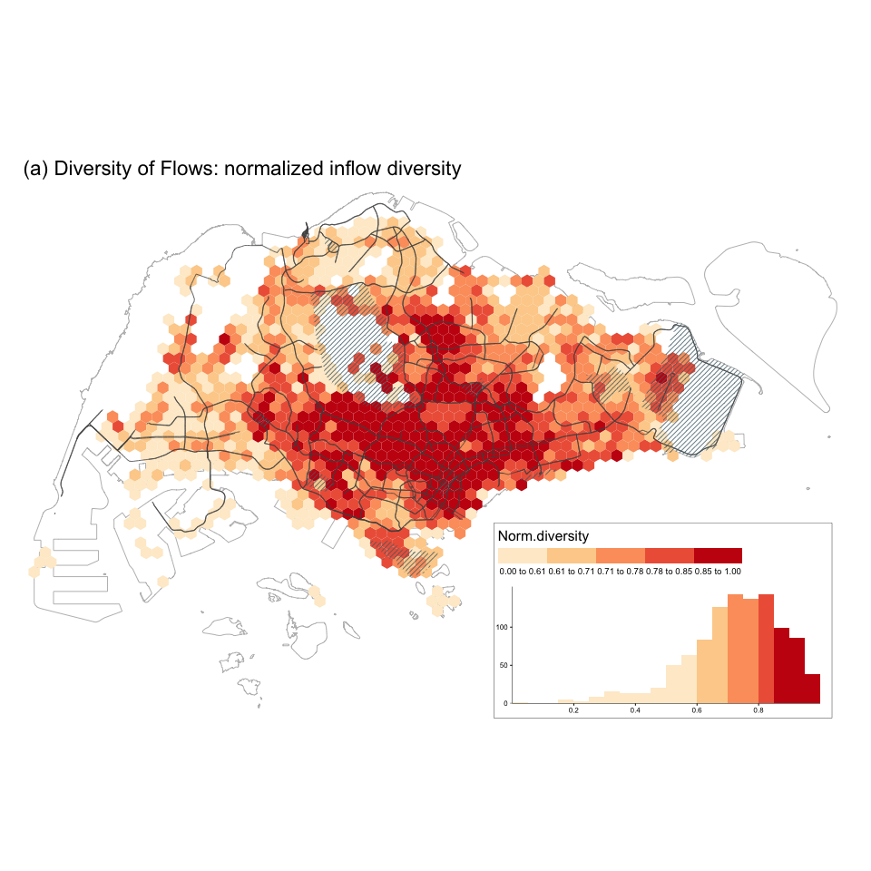
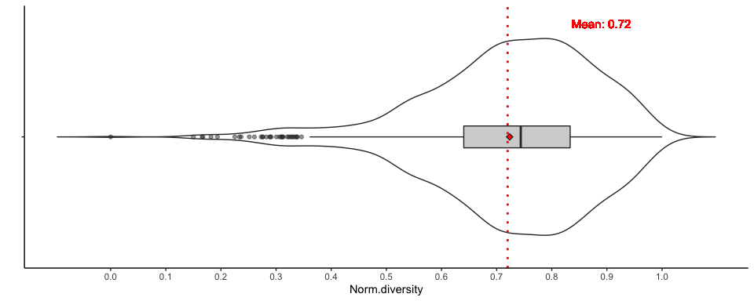
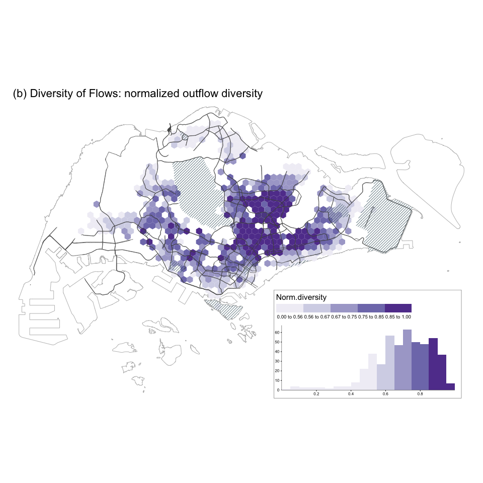
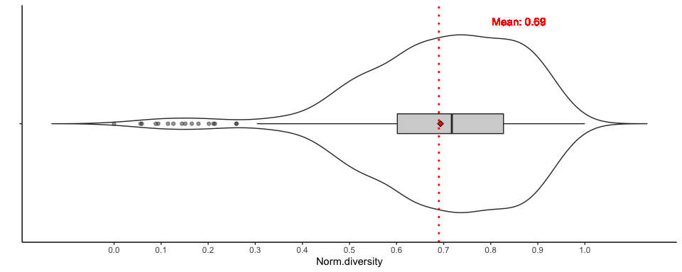

Social diversity
================
Qingqing Chen
Last compiled date: 18 September, 2021

<style>
body {text-align: justify}
</style>

To measure diversity, we use Shannon’s diversity index (H) as it is
commonly used for species diversity and accounts for both richness and
evenness of the species present. The higher the Shannon’s index (H)
value is, the more diverse the origins of visitors are for inflow
diversity. Conversely, for outflow diversity a higher H means that
locals visit a more diverse set of neighbourhoods throughout the city.

## Load necessary data

``` r
# aggregated grids 
grids <- read_sf(here("data/derived_data/spatial_hex_grid.shp"), quiet = T) %>% 
  st_transform(crs = 3414)

# Singapore planning areas 
sg_subzone <- read_sf(here("data/raw_data/sg-subzone/MP14_SUBZONE_NO_SEA_PL.shp")) %>%
  st_transform(crs = 3414) %>% 
  st_make_valid() %>% 
  group_by(PLN_AREA_N) %>% 
  dplyr::summarise()

# grid sectors 
grid_sectors <- readRDS(here("data/derived_data/grid_sectors.rds"))

# tweets
df_tweets <- readRDS(here("data/derived_data/deidentified_sg_tweets_updated.rds")) 

# qualified grid cells 
considered_grids <-  df_tweets %>% 
  group_by(grid_id) %>% 
  dplyr::summarise(n_tweets = n(), n_users = n_distinct(u_id)) %>% 
  filter(n_tweets >= 100 & n_users >= 5)

# usrs in each grid cell 
users_in_grids <- df_tweets %>% distinct(u_id, grid_id)

# identified home location of users 
identified_hms <- read_csv(here("data/derived_data/identified_hms.csv"))

# distinct users in grids: local or visitor 
distinct_users <- readRDS(here("data/derived_data/distinct_users.rds"))
```

## Diversity analysis with Shannon’s index

``` r
# function used for diversity analysis
cal_diversity <- function(grid_index, data, grid_sectors, grids, type = "inflow"){
  # get sectors of input grid 
  sectors <- grid_sectors %>% filter(grid_id == grid_index) 
  # get sector areas intersect with SG boundary 
  sectors_corssSG <- st_intersection(sectors, sg_subzone) %>% 
    dplyr::select(-PLN_AREA_N) %>% 
    unique() %>%
    group_by(sector_id, grid_id) %>% 
    dplyr::summarise() %>% 
    ungroup()
  
  # assign users to sectors 
  if(type == "inflow"){
    # assign visitors' home locations to sectors 
    users_in_sectors <- st_join(data, sectors_corssSG, largest = TRUE) %>% 
      distinct(u_id, home, .keep_all = TRUE) %>% 
      dplyr::select(sector_id, grid_id, u_id, home) %>% 
      st_set_geometry(NULL) %>% 
      left_join(., sectors_corssSG) %>% # change the geometry to sectors' geometry
      st_sf()  # convert to sf object 
  }else if(type == "outflow"){
    # assign locals visited locations to sectors 
    users_in_sectors <- st_join(data, sectors_corssSG, largest = T) %>% 
      distinct(u_id, out_to_grid, .keep_all = TRUE) %>% 
      dplyr::select(sector_id, grid_id, u_id, out_to_grid) %>% 
      st_set_geometry(NULL) %>% 
      left_join(., sectors_corssSG) %>% # change the geometry to sectors' geometry
      st_sf()
  }
  
  # calculate Shannon's index  
  output <- users_in_sectors %>%
      group_by(sector_id) %>%
      dplyr::summarise(n_user = n_distinct(u_id)) %>%
      ungroup() %>%
      mutate(area_km_square = as.numeric(st_area(.)/1000000)) %>%
      mutate(user_density = n_user/area_km_square) %>%
      st_set_geometry(NULL) %>%
      distinct(sector_id, user_density) %>%
      spread(sector_id, user_density) %>%
      diversity(index = "shannon") 
  return(output)
}
```

### Inflow diversity

The inflow diversity is saved under `data/derived_data/` directory.

``` r
# Get visitors in each grid 
visitors_in_grid <-  distinct_users %>% 
  filter(type == "visitor") %>% 
  left_join(., grids, by = c("home" = "grid_id")) %>% 
  st_as_sf(crs = 3414) %>% 
  nest(data = c(u_id, home, type, geometry))
  
# visited grid 
visitors_in_grid[1, ]
```

    ## # A tibble: 1 × 2
    ##   grid_id data        
    ##     <dbl> <list>      
    ## 1       3 <sf [3 × 4]>

``` r
# visitors with home locations 
visitors_in_grid[1, ]$data[[1]]
```

    ## Simple feature collection with 3 features and 3 fields
    ## Geometry type: POLYGON
    ## Dimension:     XY
    ## Bounding box:  xmin: 18042.54 ymin: 36100.32 xmax: 40917.54 ymax: 42162.5
    ## Projected CRS: SVY21 / Singapore TM
    ## # A tibble: 3 × 4
    ##       u_id  home type                                                   geometry
    ##      <dbl> <dbl> <chr>                                             <POLYGON [m]>
    ## 1 82965004  1594 visitor ((40542.54 36749.84, 40167.54 36966.34, 40167.54 37399…
    ## 2 90218329   626 visitor ((18417.54 36100.32, 18042.54 36316.82, 18042.54 36749…
    ## 3 49010226  1461 visitor ((35667.54 41296.47, 35292.54 41512.98, 35292.54 41945…

``` r
# calculate diversity 
if(file.exists(here("data/derived_data/inflow_diversity.rds"))){
  inflow_diversity <- readRDS(here("data/derived_data/inflow_diversity.rds"))
}else{
  inflow_diversity <- visitors_in_grid %>% 
    filter(grid_id %in% considered_grids$grid_id) %>% 
    mutate(div_shannon = map2_dbl(grid_id, data, with_progress(function(x, y) cal_diversity(x, y, grid_sectors, grids, type = "inflow")))) %>% 
    dplyr::select(-data) 
  
  inflow_diversity <- inflow_diversity %>% 
    mutate(norm_div_shannon = (div_shannon - min(div_shannon))/(max(div_shannon) - min(div_shannon))) %>% 
    left_join(., grids, by = c("grid_id" = "grid_id")) %>% 
    st_sf(crs = 3414)
  saveRDS(inflow_diversity, file = here("data/derived_data/inflow_diversity.rds"))
}
head(inflow_diversity)
```

    ## Simple feature collection with 6 features and 3 fields
    ## Geometry type: POLYGON
    ## Dimension:     XY
    ## Bounding box:  xmin: 2292.538 ymin: 24408.98 xmax: 7917.538 ymax: 35017.79
    ## Projected CRS: SVY21 / Singapore TM
    ## # A tibble: 6 × 4
    ##   grid_id div_shannon norm_div_shannon                                  geometry
    ##     <dbl>       <dbl>            <dbl>                             <POLYGON [m]>
    ## 1       3       0.691            0.166 ((2667.538 24408.98, 2292.538 24625.48, …
    ## 2       8       1.00             0.289 ((3042.538 25058.49, 2667.538 25275, 266…
    ## 3      14       1.01             0.291 ((3417.538 25708.01, 3042.538 25924.52, …
    ## 4      19       0.693            0.167 ((3792.538 25058.49, 3417.538 25275, 341…
    ## 5     123       1.36             0.430 ((7167.538 33502.24, 6792.538 33718.75, …
    ## 6     135       1.51             0.488 ((7542.538 34151.76, 7167.538 34368.27, …

### Outflow diversity

The grids except home that each local visited are saved under
`data/derived_data/` directory.

``` r
# Get other grids except home that locals visited 
# locals in home grids
locals_in_grid <- distinct_users %>% 
  filter(type == "local") %>% 
  nest(data = c(u_id, home, type))

# grids outside home grid that each local visited 
get_locals_out_grids <- function(grid_id, data, users_in_grids, grids){
  # locals in home grid 
  locals <-  data$u_id %>% unique()
  # home grid id 
  locals_home <- grid_id
  output <- users_in_grids %>% 
    filter(u_id %in% locals) %>%  ## get grids that locals sent tweets 
    filter(!grid_id %in% locals_home) %>% ## remove grid that is the same as the home
    left_join(., grids) %>% ## get out to grid geometry
    rename(out_to_grid = grid_id) %>% 
    st_sf() 
  return(output)
}

if(file.exists(here("data/derived_data/locals_out_grids.rds"))){
  locals_out_grids <- readRDS(here("data/derived_data/locals_out_grids.rds")) 
}else{
  locals_out_grids <- locals_in_grid %>% 
    filter(grid_id %in% considered_grids$grid_id) %>% 
    mutate(data = map2(grid_id, data, with_progress(function(x, y) get_locals_out_grids(x, y, users_in_grids, grids))))
  saveRDS(locals_out_grids, file = here("data/derived_data/locals_out_grids.rds"))
}

# home grid 
locals_out_grids[1, ]
```

    ## # A tibble: 1 × 2
    ##   grid_id data          
    ##     <dbl> <list>        
    ## 1     234 <sf [923 × 3]>

``` r
# locals in home grid with their visited grids outside home 
locals_out_grids[1, ]$data[[1]]
```

    ## Simple feature collection with 923 features and 2 fields
    ## Geometry type: POLYGON
    ## Dimension:     XY
    ## Bounding box:  xmin: 7917.538 ymin: 24408.98 xmax: 46167.54 ymax: 48657.69
    ## Projected CRS: SVY21 / Singapore TM
    ## # A tibble: 923 × 3
    ##        u_id out_to_grid                                                 geometry
    ##       <dbl>       <dbl>                                            <POLYGON [m]>
    ##  1 81473111         613 ((18042.54 39347.91, 17667.54 39564.42, 17667.54 39997.…
    ##  2 81473111        1187 ((29292.54 28955.61, 28917.54 29172.11, 28917.54 29605.…
    ##  3 81473111        1210 ((29667.54 30904.17, 29292.54 31120.67, 29292.54 31553.…
    ##  4 81473111        1216 ((29667.54 38698.39, 29292.54 38914.9, 29292.54 39347.9…
    ##  5 81473111         579 ((17292.54 39347.91, 16917.54 39564.42, 16917.54 39997.…
    ##  6 81473111        1233 ((30042.54 31553.68, 29667.54 31770.19, 29667.54 32203.…
    ##  7 81473111        1271 ((30792.54 30254.65, 30417.54 30471.15, 30417.54 30904.…
    ##  8 81473111         715 ((20292.54 31553.68, 19917.54 31770.19, 19917.54 32203.…
    ##  9 81473111        1125 ((28167.54 30904.17, 27792.54 31120.67, 27792.54 31553.…
    ## 10 81473111        1709 ((45417.54 37399.36, 45042.54 37615.86, 45042.54 38048.…
    ## # … with 913 more rows

The outflow diversity is saved under `data/derived_data/` directory.

``` r
# calculate outflow diversity 
if(file.exists(here("data/derived_data/outflow_diversity.rds"))){
  outflow_diversity <- readRDS(here("data/derived_data/outflow_diversity.rds"))
}else{
  outflow_diversity <- locals_out_grids %>% 
    filter(grid_id %in% considered_grids$grid_id) %>% 
    mutate(div_shannon = map2_dbl(grid_id, data, with_progress(function(x, y) cal_diversity(x, y, grid_sectors, grids, type = "outflow")))) %>% 
    dplyr::select(-data) 
  
  outflow_diversity <- outflow_diversity %>% 
    mutate(norm_div_shannon = (div_shannon - min(div_shannon))/(max(div_shannon) - min(div_shannon)), 
           norm_div_shannon = round(norm_div_shannon, 2)) %>% 
    left_join(., grids, by = c("grid_id" = "grid_id")) %>% 
    st_sf(crs = 3414)
    
  saveRDS(outflow_diversity, file = here("data/derived_data/outflow_diversity.rds"))
}

head(outflow_diversity)
```

    ## Simple feature collection with 6 features and 3 fields
    ## Geometry type: POLYGON
    ## Dimension:     XY
    ## Bounding box:  xmin: 9792.538 ymin: 34801.28 xmax: 12417.54 ymax: 38914.9
    ## Projected CRS: SVY21 / Singapore TM
    ## # A tibble: 6 × 4
    ##   grid_id div_shannon norm_div_shannon                                  geometry
    ##     <dbl>       <dbl>            <dbl>                             <POLYGON [m]>
    ## 1     234        2.15            0.367 ((10167.54 34801.28, 9792.538 35017.79, …
    ## 2     286        2.24            0.469 ((11292.54 35450.8, 10917.54 35667.31, 1…
    ## 3     287        1.99            0.179 ((11292.54 36749.84, 10917.54 36966.34, …
    ## 4     304        2.06            0.260 ((11667.54 36100.32, 11292.54 36316.82, …
    ## 5     321        2.27            0.508 ((12042.54 35450.8, 11667.54 35667.31, 1…
    ## 6     323        2.45            0.712 ((12042.54 38048.88, 11667.54 38265.38, …

## Diversity spatial distribution

### Inflow diversity

``` r
spatial_viz(inflow_diversity, fill_var = "norm_div_shannon", 
            legend_title = "Norm.diversity", 
            main_title = "(a) Diversity of Flows: normalized inflow diversity", 
            main.title_size = 1.4,
            legend.hist_height = 0.25, legend.hist_width = 0.5,
            legend_width = 0.4, legend.hist_size = 0.5,
            legend.title_size = 1.2, legend.text_size = 0.65)
```



``` r
violin_viz(inflow_diversity, var = "norm_div_shannon",  
           labs.x = "", labs.y = "Norm.diversity", breaks = seq(0, 1, 0.1),
           y.shift = 0.17, x.shift = 1.52, text.size = 4)
```



### Outflow diversity

``` r
spatial_viz(outflow_diversity, fill_var = "norm_div_shannon", 
            legend_title = "Norm.diversity", 
            main_title = "(b) Diversity of Flows: normalized outflow diversity", 
            main.title_size = 1.4,
            legend.hist_height = 0.25, legend.hist_width = 0.5,
            legend_width = 0.4, legend.hist_size = 0.5,
            legend.title_size = 1.2, legend.text_size = 0.65,
            palette = "Purples")
```



``` r
violin_viz(outflow_diversity, var = "norm_div_shannon",
           labs.x = "", labs.y = "Norm.diversity", breaks = seq(0, 1, 0.1), 
           y.shift = 0.17, x.shift = 1.52, text.size = 4)
```


