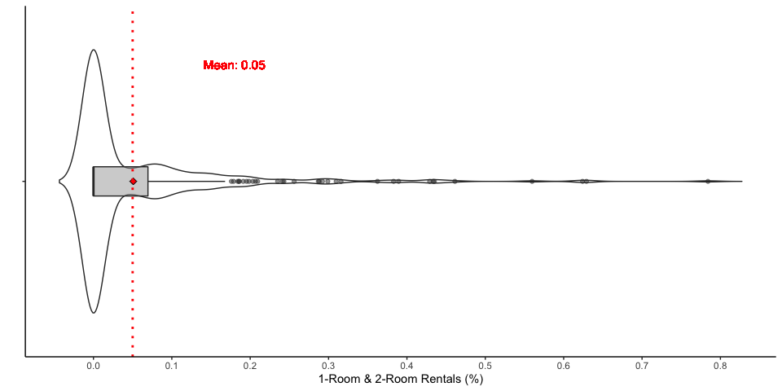

Regression analysis
================
Qingqing Chen
Last compiled date: 18 September, 2021

<style>
body {text-align: justify}
</style>

To contextualize the mobility patterns in our analysis, we compare two
of the aforementioned metrics – distance and diversity – with the
socio-economic and built environment characteristics of each
neighbourhood through a spatial regression analysis. We do so by drawing
on a set of publicly available datasets, including the HDB Resale Flat
Prices data, HDB Property Information data, SLA Street Directory data,
and LTA Train Station data. These datasets allow us to create six
independent variables shown as follows:

-   Mean resale price per square meter;
-   Percentage of 1-Room and 2-Room rental flats;
-   Percentage of residential building area;
-   Percentage of industrial building area;
-   Distance to the nearest MRT station;
-   Distance to the central grid cell.

We aggregate the variables to individual neighbourhoods (i.e. with the
same spatial resolution as neighbourhoods) and only keep neighbourhoods
that have public housing. It is important to stress that we employ this
regression model not to predict travel distance or mobility diversity
based on these independent variables but rather to provide an initial
quantitative exploration of the potential underlying covariates that
influence mobility patterns in Singapore.

## Load data

``` r
# hexagonal grids 
grids <- read_sf(here("data/derived_data/spatial_hex_grid.shp"), quiet = T) %>%
  st_transform(crs = 3414)

# grid centroids 
grid_centroids <- grids %>% st_centroid()

# HDB buildings
hdb_sf <-  read_sf(here("data/derived_data/spatial_hdb_building.shp"))

# inflow and outflow distance
dist_inflow <- readRDS(here("data/derived_data/dist_visitor_points.rds"))
dist_outflow <- readRDS(here("data/derived_data/dist_local_points.rds"))

# inflow and outflow diversity 
div_inflow <- readRDS(here("data/derived_data/inflow_diversity.rds"))
div_outflow <- readRDS(here("data/derived_data/outflow_diversity.rds"))
```

## Dependent variables

### HDB resale price

``` r
if(file.exists(here("data/derived_data/sf_resale.rds"))){
  sf_resale <- readRDS(here("data/derived_data/sf_resale.rds"))
}else{
  df_resale_12to14 <- read_csv(here("data/raw_data/resale-flat-prices/resale-flat-prices-based-on-registration-date-from-mar-2012-to-dec-2014.csv"))
  df_resale_15to16  <- read_csv(here("data/raw_data/resale-flat-prices/resale-flat-prices-based-on-registration-date-from-jan-2015-to-dec-2016.csv"))  
  df_resale <- bind_rows(df_resale_12to14, df_resale_15to16) %>% 
    mutate(month = ymd(month, truncated = 1)) %>% 
    filter(month >= '2012-07-01' & month < '2016-11-01') 
  # format street name 
  df_resale <- df_resale %>% 
    mutate(ROAD_NAME = gsub("\\bAVE\\b", "AVENUE", street_name),
           ROAD_NAME = gsub("\\bBT\\b", "BUKIT", ROAD_NAME),
           ROAD_NAME = gsub("\\bCL\\b", "CLOSE", ROAD_NAME),
           ROAD_NAME = gsub("\\bCRES\\b", "CRESCENT", ROAD_NAME),
           ROAD_NAME = gsub("\\bCTRL\\b", "CENTRAL", ROAD_NAME),
           ROAD_NAME = gsub("\\bC'WEALTH\\b", "COMMONWEALTH", ROAD_NAME),
           ROAD_NAME = gsub("\\bCTR\\b", "CENTRE", ROAD_NAME),
           ROAD_NAME = gsub("\\bDR\\b", "DRIVE", ROAD_NAME),
           ROAD_NAME = gsub("\\bGDNS\\b", "GARDENS", ROAD_NAME),
           ROAD_NAME = gsub("\\bHTS\\b", "HEIGHTS", ROAD_NAME),
           ROAD_NAME = gsub("\\bJLN\\b", "JALAN", ROAD_NAME),
           ROAD_NAME = gsub("\\bKG\\b", "KAMPONG", ROAD_NAME),
           ROAD_NAME = gsub("\\bLOR\\b", "LORONG", ROAD_NAME),
           ROAD_NAME = gsub("\\bMKT\\b", "MARKET", ROAD_NAME),
           ROAD_NAME = gsub("\\bNTH\\b", "NORTH", ROAD_NAME),
           ROAD_NAME = gsub("\\bPL\\b", "PLACE", ROAD_NAME),
           ROAD_NAME = gsub("\\bPK\\b", "PARK", ROAD_NAME),
           ROAD_NAME = gsub("\\bRD\\b", "ROAD", ROAD_NAME),
           ROAD_NAME = gsub("\\bST\\b", "STREET", ROAD_NAME),
           ROAD_NAME = gsub("\\bSTH\\b", "SOUTH", ROAD_NAME),
           ROAD_NAME = gsub("\\bTER\\b", "TERRACE", ROAD_NAME),
           ROAD_NAME = gsub("\\bTG\\b", "TANJONG", ROAD_NAME),
           ROAD_NAME = gsub("\\bUPP\\b", "UPPER", ROAD_NAME)) %>%
      mutate(ROAD_NAME = case_when(
        ROAD_NAME == "STREET. GEORGE'S LANE" ~ "SAINT GEORGE'S LANE",
        ROAD_NAME == "STREET. GEORGE'S ROAD" ~ "SAINT GEORGE'S ROAD",
        TRUE ~ ROAD_NAME
      )) %>%
      dplyr::rename(HOUSE_BLK_ = block) %>%
      unite(ROAD_BLK, c("ROAD_NAME", "HOUSE_BLK_")) %>%
      mutate(ROAD_BLK = case_when(
        ROAD_BLK == "CHOA CHU KANG AVENUE 2_297A" ~ "CHOA CHU KANG AVENUE 2_297",
        ROAD_BLK == "CHOA CHU KANG AVENUE 2_297B" ~ "CHOA CHU KANG AVENUE 2_297",
        TRUE ~ ROAD_BLK
      ))
    
   # add geometry to each resale transaction
    sf_resale <- hdb_sf %>%
      left_join(df_resale, ., by = c("ROAD_BLK" = "ROAD_BLK")) %>%
      st_as_sf() %>%
      st_transform(crs = 3414) %>%
      st_join(., grids, largest = T) %>% 
      filter(!is.na(grid_id)) 
    saveRDS(sf_resale, file = here("data/derived_data/sf_resale.rds"))
}

head(sf_resale)
```

    ## Simple feature collection with 6 features and 12 fields
    ## Geometry type: GEOMETRY
    ## Dimension:     XY
    ## Bounding box:  xmin: 28319.87 ymin: 38111.72 xmax: 30095.91 ymax: 39879.56
    ## Projected CRS: SVY21 / Singapore TM
    ##        month       town flat_type                 ROAD_BLK      street_name
    ## 1 2012-07-01 ANG MO KIO    2 ROOM  ANG MO KIO AVENUE 4_174 ANG MO KIO AVE 4
    ## 2 2012-07-01 ANG MO KIO    3 ROOM  ANG MO KIO AVENUE 5_154 ANG MO KIO AVE 5
    ## 3 2012-07-01 ANG MO KIO    3 ROOM ANG MO KIO AVENUE 1_226B ANG MO KIO AVE 1
    ## 4 2012-07-01 ANG MO KIO    3 ROOM  ANG MO KIO AVENUE 1_333 ANG MO KIO AVE 1
    ## 5 2012-07-01 ANG MO KIO    3 ROOM  ANG MO KIO AVENUE 5_150 ANG MO KIO AVE 5
    ## 6 2012-07-01 ANG MO KIO    3 ROOM  ANG MO KIO AVENUE 4_170 ANG MO KIO AVE 4
    ##   storey_range floor_area_sqm     flat_model lease_commence_date resale_price
    ## 1     10 TO 12             45       Improved                1986       260000
    ## 2     01 TO 03             68 New Generation                1981       303000
    ## 3     01 TO 03             66       Improved                1994       303000
    ## 4     01 TO 03             68 New Generation                1981       315000
    ## 5     01 TO 03             68 New Generation                1981       315000
    ## 6     10 TO 12             61       Improved                1986       315000
    ##   remaining_lease grid_id                       geometry
    ## 1              NA    1153 MULTIPOLYGON (((28487.98 39...
    ## 2              NA    1153 MULTIPOLYGON (((28840.93 39...
    ## 3              NA    1152 POLYGON ((28685.74 38805.59...
    ## 4              NA    1238 MULTIPOLYGON (((30012.41 38...
    ## 5              NA    1195 MULTIPOLYGON (((29007.03 39...
    ## 6              NA    1153 MULTIPOLYGON (((28397.28 39...

``` r
mean_resale <- sf_resale %>% 
  st_set_geometry(NULL) %>% 
  dplyr::select(grid_id, floor_area_sqm, resale_price) %>% 
  mutate(resale_price_sqm = resale_price/floor_area_sqm) %>% 
  group_by(grid_id) %>% 
  dplyr::summarise(mean_resale_price_sqm = mean(resale_price_sqm),
                   sd_resale_price_sqm = sd(resale_price_sqm)) 

## grid cells with available socio-economic variables and human mobility indicators
qualified_grids_inflow <- intersect(mean_resale$grid_id, div_inflow$grid_id) %>% intersect(dist_inflow$grid_id)
qualified_grids_outflow <- intersect(mean_resale$grid_id, div_outflow$grid_id) %>% intersect(dist_outflow$grid_id)

mean_resale_sf <- mean_resale %>%
  filter(grid_id %in% qualified_grids_inflow) %>% 
  left_join(., grids, by = c("grid_id" = "grid_id")) %>% 
  st_sf()
```

``` r
spatial_viz(mean_resale_sf, 
            fill_var = "mean_resale_price_sqm", 
            legend_title = "Avg.resale price/sqm", 
            main_title = "(a) Spatial distribution of average resale price", 
            main.title_size = 1.4,
            legend.hist_height = 0.25, legend.hist_width = 0.5,
            legend_width = 0.4, legend.hist_size = 0.5,
            legend.title_size = 1.2, legend.text_size = 0.65,
            digits = 0, palette = "PuRd")
```


``` r
# spatial_viz(mean_resale_sf, 
#             fill_var = "sd_resale_price_sqm", 
#             legend_title = "S.D.resale price/sqm", 
#             main_title = "(a) Spatial distribution of S.D of resale price", 
#             main.title_size = 1.4,
#             legend.hist_height = 0.25, legend.hist_width = 0.5,
#             legend_width = 0.4, legend.hist_size = 0.5,
#             legend.title_size = 1.2, legend.text_size = 0.65,
#             digits = 0, palette = "PuRd")
```

``` r
violin_viz(mean_resale_sf, var = "mean_resale_price_sqm", 
           labs.x = "", labs.y = "Avg.resale price/sqm", breaks = seq(0, 9000, 1000),
           y.shift = 1050, x.shift = 1.4, text.size = 4, digits = 0)
```


### Percentage of 1-ROOM and 2-Room rental flats

``` r
#HDB Property Information: https://data.gov.sg/dataset/hdb-property-information
if(file.exists(here("data/derived_data/df_pct_1_2room_rental.rds"))){
  df_pct_1_2room_rental <- readRDS(here("data/derived_data/df_pct_1_2room_rental.rds"))
}else{
  df_hdb_property <- read_csv(here("data/raw_data/hdb-property-information.csv")) 
  df_hdb_property_updated <-  df_hdb_property %>% 
    mutate(ROAD_NAME = gsub("\\bDR\\b", "DRIVE", street),
           ROAD_NAME = gsub("\\bRD\\b", "ROAD", ROAD_NAME),
           ROAD_NAME = gsub("\\bCRES\\b", "CRESCENT", ROAD_NAME),
           ROAD_NAME = gsub("\\bAVE\\b", "AVENUE", ROAD_NAME),
           ROAD_NAME = gsub("\\bST\\b", "STREET", ROAD_NAME),
           ROAD_NAME = gsub("\\bCTRL\\b", "CENTRAL", ROAD_NAME),
           ROAD_NAME = gsub("\\bNTH\\b", "NORTH", ROAD_NAME),
           ROAD_NAME = gsub("\\bSTH\\b", "SOUTH", ROAD_NAME),
           ROAD_NAME = gsub("\\bBT\\b", "BUKIT", ROAD_NAME),
           ROAD_NAME = gsub("\\bC'WEALTH\\b", "COMMONWEALTH", ROAD_NAME),
           ROAD_NAME = gsub("\\bCL\\b", "CLOSE", ROAD_NAME),
           ROAD_NAME = gsub("\\bPK\\b", "PARK", ROAD_NAME),
           ROAD_NAME = gsub("\\bJLN\\b", "JALAN", ROAD_NAME),
           ROAD_NAME = gsub("\\bKG\\b", "KAMPONG", ROAD_NAME),
           ROAD_NAME = gsub("\\bPL\\b", "PLACE", ROAD_NAME),
           ROAD_NAME = gsub("\\bLOR\\b", "LORONG", ROAD_NAME),
           ROAD_NAME = gsub("\\bTER\\b", "TERRACE", ROAD_NAME),
           ROAD_NAME = gsub("\\bMKT\\b", "MARKET", ROAD_NAME),
           ROAD_NAME = gsub("\\bUPP\\b", "UPPER", ROAD_NAME),
           ROAD_NAME = gsub("\\bGDNS\\b", "GARDENS", ROAD_NAME),
           ROAD_NAME = gsub("\\bTG\\b", "TANJONG", ROAD_NAME),
           ROAD_NAME = gsub("\\bHTS\\b", "HEIGHTS", ROAD_NAME),
           ROAD_NAME = gsub("\\bCTR\\b", "CENTRE", ROAD_NAME)) %>%
    mutate(ROAD_NAME = case_when(
          ROAD_NAME == "STREET. GEORGE'S LANE" ~ "SAINT GEORGE'S LANE",
          ROAD_NAME == "STREET. GEORGE'S ROAD" ~ "SAINT GEORGE'S ROAD",
          ROAD_NAME == "SECTOR A SIN MING IND EST" ~ "SECTOR A SIN MING INDUSTRIAL ESTATE", 
          TRUE ~ ROAD_NAME
          ))  %>%
    dplyr::rename(HOUSE_BLK_ = blk_no) %>%
    unite(ROAD_BLK, c("ROAD_NAME", "HOUSE_BLK_")) %>% 
    dplyr::select(ROAD_BLK, `1room_rental`, `2room_rental`, total_dwelling_units) %>% 
    mutate(ROAD_BLK = case_when(
            ROAD_BLK == "CHOA CHU KANG AVENUE 2_297A" ~ "CHOA CHU KANG AVENUE 2_297",
            ROAD_BLK == "CHOA CHU KANG AVENUE 2_297B" ~ "CHOA CHU KANG AVENUE 2_297",
            TRUE ~ ROAD_BLK
          ))
      
  # get extra two Blks that are under 'S' and 'K' building type
  extra_building_sf <- df_building %>% 
    filter(ROAD_NAME %in% c("NEW MARKET ROAD", "JALAN KUKOH") & HOUSE_BLK_ %in% c(1, 32)) %>% 
    unite(ROAD_BLK, c("ROAD_NAME", "HOUSE_BLK_")) %>% 
    st_transform(crs = 3414) %>% 
    dplyr::select(names(hdb_sf))

  df_1_2room_rental <- df_hdb_property_updated %>% 
    filter(total_dwelling_units != 0) %>% 
    left_join(., rbind(hdb_sf, extra_building_sf)) %>% 
    st_as_sf() %>% 
    st_make_valid() %>% 
    st_join(., grids, largest = T) %>% # join grids 
    filter(!is.na(grid_id)) %>% 
    group_by(grid_id) %>% 
    dplyr::summarise(`1room_rental` = sum(`1room_rental`), 
                     `2room_rental` = sum(`2room_rental`), 
                      total_dwelling_units = sum(total_dwelling_units))
    
  df_pct_1_2room_rental <- df_1_2room_rental %>% 
    st_set_geometry(NULL) %>% 
    mutate(pct_1_2room_rental = (`1room_rental` + `2room_rental`)/total_dwelling_units) 
  saveRDS(df_pct_1_2room_rental, file = here("data/derived_data/df_pct_1_2room_rental.rds"))
}
head(df_pct_1_2room_rental)
```

    ## # A tibble: 6 × 5
    ##   grid_id `1room_rental` `2room_rental` total_dwelling_units pct_1_2room_rental
    ##     <int>          <dbl>          <dbl>                <dbl>              <dbl>
    ## 1     286              0              0                  795              0    
    ## 2     304              0              0                   99              0    
    ## 3     321            273            273                 4208              0.130
    ## 4     338              0              0                 1372              0    
    ## 5     339              0              0                 4079              0    
    ## 6     354              0              0                 6653              0

``` r
df_pct_1_2room_rental_sf <- df_pct_1_2room_rental %>% 
              filter(grid_id %in% qualified_grids_inflow) %>% 
              left_join(., grids, by = c("grid_id" = "grid_id")) %>% 
              st_sf()

spatial_viz(df_pct_1_2room_rental_sf, 
            fill_var = "pct_1_2room_rental", 
            legend_title = "1&2 Room rentals (%)", 
            main_title = "(b) Spatial distribution of 1-Room and 2-Room rentals", 
            main.title_size = 1.4,
            legend.hist_height = 0.25, legend.hist_width = 0.5,
            legend_width = 0.4, legend.hist_size = 0.5,
            legend.title_size = 1.2, legend.text_size = 0.65, palette = "PuRd", 
            style = "fixed",
            breaks = c(0, 0.05, 0.1, 0.3, 0.5, 0.8))
```


``` r
violin_viz(df_pct_1_2room_rental_sf,
           var = "pct_1_2room_rental",
           labs.x = "", labs.y = "1-Room & 2-Room Rentals (%)", 
           breaks = seq(0, 0.8, 0.1),
           y.shift = 0.13, x.shift = 1.4, text.size = 4)
```



### Landuse: Percentage of industrial building

``` r
cal_building_area <- function(index, building_sf){
  # intersect with grids 
  intersect_grid <- building_sf %>% 
    filter(FEA_ID == index) %>% 
    st_make_valid() %>% 
    st_intersection(., grids) 
  # intersect area in grids
  intersect_grid %>% 
    st_set_geometry(NULL) %>% 
    dplyr::mutate(area_sqm = st_area(intersect_grid) %>% as.numeric()) %>% 
    dplyr::select(FEA_ID, grid_id, area_sqm)
}

if(file.exists(here("data/derived_data/industrial_areas_grids.rds"))){
  industrial_areas_grids <- readRDS(here("data/derived_data/industrial_areas_grids.rds"))
}else{
  #building type: I
  industrial_sf <- df_building %>% 
    filter(BLDG_TYPE_ == "I") %>% 
    filter(DATA_TYPE_ == "extg") %>% # Existing building outline
    st_transform(crs = 3414) %>% 
    unite(ROAD_BLK, c("ROAD_NAME", "HOUSE_BLK_"), sep = " ") 

  FEA_indexes <- industrial_sf$FEA_ID
  # industrial building areas in grids 
  industrial_areas_grids <- do.call(bind_rows, map(FEA_indexes, with_progress(function(x) cal_building_area(x, industrial_sf))))
  # percentage of commercial areas in grids 
  industrial_areas_grids <- industrial_areas_grids %>% 
    group_by(grid_id) %>% 
    dplyr::summarise(industrial_area_sqm = sum(area_sqm)) %>% 
    mutate(grid_area = st_area(grids[1, ]) %>% as.numeric(),
           pct_industrial_area = round(industrial_area_sqm/grid_area, 4)) 
  saveRDS(industrial_areas_grids, file = here("data/derived_data/industrial_areas_grids.rds"))
}

head(industrial_areas_grids)
```

    ## # A tibble: 6 × 4
    ##   grid_id industrial_area_sqm grid_area pct_industrial_area
    ##     <int>               <dbl>     <dbl>               <dbl>
    ## 1       8               1044.   487139.              0.0021
    ## 2       9               7940.   487139.              0.0163
    ## 3      13               7004.   487139.              0.0144
    ## 4      14              25922.   487139.              0.0532
    ## 5      16                209.   487139.              0.0004
    ## 6      19              29082.   487139.              0.0597

``` r
industrial_areas_grids_sf <- industrial_areas_grids %>% 
              filter(grid_id %in% qualified_grids_inflow) %>% 
              left_join(grids %>% filter(grid_id %in% qualified_grids_inflow), ., by = c("grid_id" = "grid_id")) %>% 
              replace(., is.na(.), 0) %>% 
              st_sf()

spatial_viz(industrial_areas_grids_sf, 
            fill_var = "pct_industrial_area", 
            legend_title = "Industrial area (%)", 
            main_title = "(c) Spatial distribution of industrial area", 
            main.title_size = 1.4,
            legend.hist_height = 0.25, legend.hist_width = 0.5,
            legend_width = 0.4, legend.hist_size = 0.5,
            legend.title_size = 1.2, legend.text_size = 0.65, palette = "PuRd", 
            style = "fixed",
            breaks = c(0, 0.05, 0.1, 0.15, 0.2, 0.25))
```


``` r
violin_viz(industrial_areas_grids_sf,
           var = "pct_industrial_area",
           labs.x = "", labs.y = "Industrial area (%)", 
           breaks = seq(0, 0.25, 0.05), digits = 3,
           y.shift = 0.04, x.shift = 1.4, text.size = 4)
```


### Landuse: Percentage of residential building

``` r
if(file.exists(here("data/derived_data/residential_areas_grids.rds"))){
  residential_areas_grids <- readRDS(here("data/derived_data/residential_areas_grids.rds"))
}else{
  #building type: C-Condominium, H-HDB Building, A-Apartment, E-Executive Condominium, R-Residential
  residential_sf <- df_building %>% 
    filter(BLDG_TYPE_ %in% c("C", "H", "A", "E", "R")) %>% 
    filter(DATA_TYPE_ == "extg") %>% # Existing building outline
    st_transform(crs = 3414) %>% 
    unite(ROAD_BLK, c("ROAD_NAME", "HOUSE_BLK_"), sep = " ") 

  FEA_indexes <- residential_sf$FEA_ID
  # residential areas in grids 
  residential_areas_grids <- do.call(bind_rows, map(FEA_indexes, with_progress(function(x) cal_building_area(x, residential_sf))))
  # percentage of residential areas in grids 
  residential_areas_grids <- residential_areas_grids %>% 
    group_by(grid_id) %>% 
    dplyr::summarise(residential_area_sqm = sum(area_sqm)) %>% 
    mutate(grid_area = st_area(grids[1, ]) %>% as.numeric(),
           pct_residential_area = round(residential_area_sqm/grid_area, 4)) 
  saveRDS(residential_areas_grids, file = here("data/derived_data/residential_areas_grids.rds"))
}

head(residential_areas_grids)
```

    ## # A tibble: 6 × 4
    ##   grid_id residential_area_sqm grid_area pct_residential_area
    ##     <int>                <dbl>     <dbl>                <dbl>
    ## 1     286                9461.   487139.               0.0194
    ## 2     304                 563.   487139.               0.0012
    ## 3     321               72846.   487139.               0.150 
    ## 4     338               13626.   487139.               0.028 
    ## 5     339               57370.   487139.               0.118 
    ## 6     354               75537.   487139.               0.155

``` r
residential_areas_grids_sf <- residential_areas_grids %>% 
              filter(grid_id %in% qualified_grids_inflow) %>% 
              left_join(., grids, by = c("grid_id" = "grid_id")) %>% 
  st_sf()

spatial_viz(residential_areas_grids_sf, 
            fill_var = "pct_residential_area", 
            legend_title = "Residential area (%)", 
            main_title = "(d) Spatial distribution of residential area", 
            main.title_size = 1.4,
            legend.hist_height = 0.25, legend.hist_width = 0.5,
            legend_width = 0.4, legend.hist_size = 0.5,
            legend.title_size = 1.2, legend.text_size = 0.65,
            palette = "PuRd")
```


``` r
violin_viz(residential_areas_grids_sf, 
           var = "pct_residential_area", 
           labs.x = "", labs.y = "Residential area (%)", 
           breaks = seq(0, 0.32, 0.05),
           y.shift = 0.06, x.shift = 1.55, text.size = 4)
```


### Distance to the nearest MRT station

``` r
cal_dist2nearestMRT <- function(grid_index, grids, mrt){
  grid_centroid <- grids[grid_index, ] %>% st_centroid() 
  # create 20k buffer 
  grid_buffer <-  grid_centroid %>% st_buffer(20000) 
  # get MRT stations within the buffer 
  mrt_station_in_buffer <- grid_buffer %>% 
    st_join(mrt, .) %>%
    filter(!is.na(grid_id))
  
  # distance from grid centroid to MRT stations 
  dist2MRT <- st_distance(st_geometry(grid_centroid), st_geometry(mrt_station_in_buffer), by_element = TRUE) %>% as.numeric()
  
  # get the nearest distance 
  mrt_station_in_buffer %>% 
    st_set_geometry(NULL) %>% 
    mutate(dist2MRT_km = round(dist2MRT/1000, 4)) %>% 
    arrange(dist2MRT_km) %>% 
    slice(1)
}

if(file.exists(here("data/derived_data/dist2MRT_nearest.rds"))){
  dist2MRT_nearest <- readRDS(here("data/derived_data/dist2MRT_nearest.rds"))
}else{
  # MRT station
  mrt <- read_sf(here("data/raw_data/TrainStation_Jan2020/MRTLRTStnPtt.Shp"), quiet = T) %>% 
    st_transform(crs = 3414)
  dist2MRT_nearest <- do.call(bind_rows, map(grids$grid_id, with_progress(function(x) cal_dist2nearestMRT(x, grids, mrt))))
  saveRDS(dist2MRT_nearest, file = here("data/derived_data/dist2MRT_nearest.rds"))
}

head(dist2MRT_nearest)
```

    ##   OBJECTID                  STN_NAME STN_NO grid_id dist2MRT_km
    ## 1       25 TUAS CRESCENT MRT STATION   EW31       1     12.4307
    ## 2       25 TUAS CRESCENT MRT STATION   EW31       2     11.2449
    ## 3       25 TUAS CRESCENT MRT STATION   EW31       3     10.0871
    ## 4       25 TUAS CRESCENT MRT STATION   EW31       4      8.9681
    ## 5       25 TUAS CRESCENT MRT STATION   EW31       5      7.9044
    ## 6       25 TUAS CRESCENT MRT STATION   EW31       6     11.6869

``` r
dist2MRT_nearest_sf <- dist2MRT_nearest %>% 
              filter(grid_id %in% qualified_grids_inflow) %>% 
              left_join(., grids, by = c("grid_id" = "grid_id")) %>% 
  st_sf()

spatial_viz(dist2MRT_nearest_sf, 
            fill_var = "dist2MRT_km", 
            legend_title = "Distance (km)", 
            main_title = "(e) Spatial distribution of distance to the nearest MRT station", 
            main.title_size = 1.4,
            legend.hist_height = 0.25, legend.hist_width = 0.5,
            legend_width = 0.4, legend.hist_size = 0.5,
            legend.title_size = 1.2, legend.text_size = 0.65,
            palette = "PuRd")
```


``` r
violin_viz(dist2MRT_nearest_sf, 
           var = "dist2MRT_km", 
           labs.x = "", labs.y = "Distance (km)", 
           breaks = seq(0, 2.5, 0.5),
           y.shift = 0.5, x.shift = 1.4, text.size = 4)
```


### Distance from grid to ‘center’ grid 1232 - City Hall

``` r
center_grid <- grid_centroids %>% filter(grid_id == 1232)
dist2_center_grid <- grid_centroids %>% 
  mutate(dist_grid2center = st_distance(., center_grid) %>% as.numeric(),
         dist_grid2center_km = dist_grid2center/1000) %>% 
  st_set_geometry(NULL)
head(dist2_center_grid)
```

    ## # A tibble: 6 × 3
    ##   grid_id dist_grid2center dist_grid2center_km
    ##     <int>            <dbl>               <dbl>
    ## 1       1           28648.                28.6
    ## 2       2           28292.                28.3
    ## 3       3           27992.                28.0
    ## 4       4           27750                 27.8
    ## 5       5           27567.                27.6
    ## 6       6           28102.                28.1

``` r
dist2_center_grid_sf <- dist2_center_grid %>% 
              filter(grid_id %in% qualified_grids_inflow) %>% 
              left_join(., grids, by = c("grid_id" = "grid_id")) %>% st_sf()

spatial_viz(dist2_center_grid_sf, 
            fill_var = "dist_grid2center_km", 
            legend_title = "Distance (km)", 
            main_title = "(f) Spatial distribution of distance to the central location", 
            main.title_size = 1.4,
            legend.hist_height = 0.25, legend.hist_width = 0.5,
            legend_width = 0.4, legend.hist_size = 0.5,
            legend.title_size = 1.2, legend.text_size = 0.65,
            palette = "PuRd")
```


``` r
violin_viz(dist2_center_grid_sf, 
           var = "dist_grid2center_km", 
           labs.x = "", labs.y = "Distance (km)", 
           breaks = seq(0, 20, 5),
           y.shift = 5, x.shift = 1.55, text.size = 4)
```


## Dependent variables

### Travel distance

``` r
# visitors travel distance 
mean_dist_inflow <- dist_inflow %>% 
  group_by(grid_id, u_id) %>% 
  dplyr::summarise(mean_dist_user = mean(dist_hm2grid_km)) %>% 
  group_by(grid_id) %>% 
  dplyr::summarise(mean_dist_km = mean(mean_dist_user)) %>% 
  mutate(user_type = "visitor") 

# locals travel distance 
mean_dist_outflow <- dist_outflow %>% 
  group_by(home, u_id) %>% 
  dplyr::summarise(mean_dist_user = mean(dist_hm2grid_km)) %>% 
  group_by(home) %>% 
  dplyr::summarise(mean_dist_km = mean(mean_dist_user)) %>% 
  dplyr::rename(grid_id = home) %>% mutate(user_type = "local")
```

``` r
ggplot(bind_rows(mean_dist_inflow, mean_dist_outflow)) +
  geom_density(aes(mean_dist_km, fill = user_type, color = user_type), alpha = 0.5) +
  geom_vline(data = bind_rows(mean_dist_inflow, mean_dist_outflow) %>% group_by(user_type) %>% dplyr::summarise(mean = mean(mean_dist_km)), aes(xintercept = mean, color = user_type), size=1.5) +
  theme_bw() +
  theme(legend.position = c(0.9, 0.9)) +
  labs(x = "Avg.distance (km)", y = "Density", fill = "User type", color = "User type")
```


### Mobility diversity

``` r
combinded_div <- div_inflow %>%
  st_set_geometry(NULL) %>%
  mutate(div_type = "Inflow") %>%
  bind_rows(.,
            div_outflow %>%
            st_set_geometry(NULL) %>%
            mutate(div_type = "Outflow")) %>%
  mutate(div_type = factor(div_type, levels = c("Outflow", "Inflow")))

combinded_div_mean <- combinded_div %>%
  group_by(div_type) %>%
  dplyr::summarise(mean = mean(norm_div_shannon)) %>%
  mutate(div_type = factor(div_type, levels = c("Outflow", "Inflow")))

ggplot(combinded_div, aes(norm_div_shannon, color = div_type, fill = div_type)) +
  geom_density(alpha = 0.5) +
  geom_vline(data = combinded_div_mean, aes(xintercept = mean, color = div_type), size = 1.5) +
  scale_x_continuous(breaks = seq(0, 1, 0.2)) +
  labs(x = "Normalized diversity", y = "Density", title = "Density distribution of normalized diversity", fill = "Diversity type", color = "Diversity type") +
  theme_bw() +
  theme(legend.position = c(0.1, 0.9))
```


## Regression analysis

### Inflow travel distance

``` r
## gather independent and dependent variables 
reg_inflow_dist <- mean_resale %>% 
  filter(grid_id %in% qualified_grids_inflow) %>% 
  left_join(., mean_dist_inflow %>% dplyr::select(-user_type)) %>% 
  left_join(., industrial_areas_grids %>% dplyr::select(grid_id, pct_industrial_area)) %>% 
  left_join(., residential_areas_grids %>% dplyr::select(grid_id, pct_residential_area)) %>%
  left_join(., dist2MRT_nearest %>% dplyr::select(grid_id, dist2MRT_km)) %>% 
  left_join(., df_pct_1_2room_rental %>% dplyr::select(grid_id, pct_1_2room_rental)) %>% 
  left_join(., dist2_center_grid %>% dplyr::select(grid_id, dist_grid2center_km)) %>% 
  replace(., is.na(.), 0)
head(reg_inflow_dist)
```

    ## # A tibble: 6 × 9
    ##   grid_id mean_resale_price_sqm sd_resale_price_sqm mean_dist_km pct_industrial_…
    ##     <dbl>                 <dbl>               <dbl>        <dbl>            <dbl>
    ## 1     286                 3685.                396.         14.7           0     
    ## 2     304                 3571.                323.         12.6           0     
    ## 3     321                 3808.                445.         14.0           0     
    ## 4     338                 4775.                464.         11.2           0.0936
    ## 5     339                 3518.                253.         13.9           0     
    ## 6     354                 4186.                461.         13.1           0     
    ## # … with 4 more variables: pct_residential_area <dbl>, dist2MRT_km <dbl>,
    ## #   pct_1_2room_rental <dbl>, dist_grid2center_km <dbl>

#### OLS

Formula:
`Inflow distance ~ HDB resale price + Percentage of 1 ROOM and 2 Room rentals + Percentage of industrial building + Percentage of residential building + Distance to the nearest MRT station  + Distance to the central grid)`

``` r
ols_inflow_dist <- lm(mean_dist_km ~ mean_resale_price_sqm + pct_1_2room_rental + pct_industrial_area + pct_residential_area + dist2MRT_km  + dist_grid2center_km, data = reg_inflow_dist)

summary(ols_inflow_dist)
```

    ## 
    ## Call:
    ## lm(formula = mean_dist_km ~ mean_resale_price_sqm + pct_1_2room_rental + 
    ##     pct_industrial_area + pct_residential_area + dist2MRT_km + 
    ##     dist_grid2center_km, data = reg_inflow_dist)
    ## 
    ## Residuals:
    ##     Min      1Q  Median      3Q     Max 
    ## -2.8272 -0.9806 -0.0888  0.8180  4.5572 
    ## 
    ## Coefficients:
    ##                         Estimate Std. Error t value Pr(>|t|)    
    ## (Intercept)            2.1725265  0.9489659   2.289  0.02266 *  
    ## mean_resale_price_sqm  0.0009083  0.0001338   6.787 4.98e-11 ***
    ## pct_1_2room_rental     1.9795891  0.7186578   2.755  0.00619 ** 
    ## pct_industrial_area   -4.2909212  2.0240122  -2.120  0.03472 *  
    ## pct_residential_area  -2.4026791  1.3876470  -1.731  0.08426 .  
    ## dist2MRT_km            0.3202552  0.1755298   1.825  0.06894 .  
    ## dist_grid2center_km    0.2124682  0.0259493   8.188 5.18e-15 ***
    ## ---
    ## Signif. codes:  0 '***' 0.001 '**' 0.01 '*' 0.05 '.' 0.1 ' ' 1
    ## 
    ## Residual standard error: 1.36 on 346 degrees of freedom
    ## Multiple R-squared:  0.1888, Adjusted R-squared:  0.1747 
    ## F-statistic: 13.42 on 6 and 346 DF,  p-value: 1.091e-13

``` r
spatial_viz(augment(ols_inflow_dist, data = reg_inflow_dist) %>% left_join(., grids) %>% st_as_sf(), 
            fill_var = ".resid", palette = "RdBu",
            legend_title = "Residual (OLS)", 
            main_title = "(a) Residuals of average incoming distance (Moran I statistic: 0.78)", 
            main.title_size = 1.6,
            legend.hist_height = 0.25, legend.hist_width = 0.5,
            legend_width = 0.4, legend.hist_size = 0.5,
            legend.title_size = 1.2, legend.text_size = 0.65)
```


#### Spatial Error Model (SEM)

``` r
sf_reg_inflow_dist <- reg_inflow_dist %>% 
  left_join(., grids) %>% 
  st_as_sf() %>% 
  st_transform(crs = 4326)

dist_inflow_sp <- as(sf_reg_inflow_dist, 'Spatial')
dist_inflow_neighbors <- poly2nb(dist_inflow_sp)
summary(dist_inflow_neighbors)
```

    ## Neighbour list object:
    ## Number of regions: 353 
    ## Number of nonzero links: 1466 
    ## Percentage nonzero weights: 1.17648 
    ## Average number of links: 4.152975 
    ## Link number distribution:
    ## 
    ##  1  2  3  4  5  6 
    ##  4 39 76 86 76 72 
    ## 4 least connected regions:
    ## 128 244 247 302 with 1 link
    ## 72 most connected regions:
    ## 6 9 10 19 38 46 53 57 70 75 77 93 107 109 115 123 126 130 131 134 137 138 142 147 163 164 167 170 171 175 176 179 185 190 192 193 198 200 204 206 209 211 212 216 217 221 231 257 258 262 263 264 268 269 270 273 274 281 286 291 307 308 314 317 324 332 338 341 342 343 345 346 with 6 links

``` r
dist_inflow_weights <- nb2listw(dist_inflow_neighbors, style="W", zero.policy=TRUE)
```

``` r
moran.test(dist_inflow_sp$mean_dist_km, dist_inflow_weights)
```

    ## 
    ##  Moran I test under randomisation
    ## 
    ## data:  dist_inflow_sp$mean_dist_km  
    ## weights: dist_inflow_weights    
    ## 
    ## Moran I statistic standard deviate = 20.366, p-value < 2.2e-16
    ## alternative hypothesis: greater
    ## sample estimates:
    ## Moran I statistic       Expectation          Variance 
    ##       0.777633909      -0.002840909       0.001468666

``` r
sem_inflow_dist <- spatialreg::errorsarlm(mean_dist_km ~ mean_resale_price_sqm + pct_1_2room_rental +  pct_industrial_area + pct_residential_area + pct_industrial_area + dist2MRT_km + dist_grid2center_km, data =  reg_inflow_dist, listw = dist_inflow_weights)
 
summary(sem_inflow_dist)
```

    ## 
    ## Call:spatialreg::errorsarlm(formula = mean_dist_km ~ mean_resale_price_sqm + 
    ##     pct_1_2room_rental + pct_industrial_area + pct_residential_area + 
    ##     pct_industrial_area + dist2MRT_km + dist_grid2center_km, 
    ##     data = reg_inflow_dist, listw = dist_inflow_weights)
    ## 
    ## Residuals:
    ##       Min        1Q    Median        3Q       Max 
    ## -1.882582 -0.461242 -0.059318  0.468540  2.693693 
    ## 
    ## Type: error 
    ## Coefficients: (asymptotic standard errors) 
    ##                          Estimate  Std. Error z value  Pr(>|z|)
    ## (Intercept)            7.6813e+00  8.6433e-01  8.8870 < 2.2e-16
    ## mean_resale_price_sqm  4.9152e-05  1.0561e-04  0.4654  0.641649
    ## pct_1_2room_rental     5.1959e-01  4.1127e-01  1.2634  0.206444
    ## pct_industrial_area   -3.2302e+00  1.2701e+00 -2.5433  0.010982
    ## pct_residential_area   2.4437e+00  8.8488e-01  2.7616  0.005752
    ## dist2MRT_km           -2.3525e-01  1.5047e-01 -1.5634  0.117956
    ## dist_grid2center_km    7.9053e-02  4.4728e-02  1.7674  0.077161
    ## 
    ## Lambda: 0.80697, LR test value: 318.77, p-value: < 2.22e-16
    ## Asymptotic standard error: 0.026271
    ##     z-value: 30.717, p-value: < 2.22e-16
    ## Wald statistic: 943.52, p-value: < 2.22e-16
    ## 
    ## Log likelihood: -446.3775 for error model
    ## ML residual variance (sigma squared): 0.56934, (sigma: 0.75455)
    ## Number of observations: 353 
    ## Number of parameters estimated: 9 
    ## AIC: 910.76, (AIC for lm: 1227.5)

``` r
sf_reg_inflow_dist$resid_error <- residuals(sem_inflow_dist)

spatial_viz(sf_reg_inflow_dist,
            fill_var = "resid_error",
            legend_title = "Residual (SEM)", palette = "RdBu",
            main_title = "(a) Residuals of average incoming distance (Moran I statistic: - 0.09)",
            main.title_size = 1.6,
            legend.hist_height = 0.25, legend.hist_width = 0.5,
            legend_width = 0.4, legend.hist_size = 0.5,
            legend.title_size = 1.2, legend.text_size = 0.65)
```


``` r
moran.test(sf_reg_inflow_dist$resid_error, dist_inflow_weights)
```

    ## 
    ##  Moran I test under randomisation
    ## 
    ## data:  sf_reg_inflow_dist$resid_error  
    ## weights: dist_inflow_weights    
    ## 
    ## Moran I statistic standard deviate = -2.344, p-value = 0.9905
    ## alternative hypothesis: greater
    ## sample estimates:
    ## Moran I statistic       Expectation          Variance 
    ##      -0.092696925      -0.002840909       0.001469509

#### Spatial Lag Model (SLM)

``` r
slm_inflow_dist <- spatialreg::lagsarlm(mean_dist_km ~ mean_resale_price_sqm + pct_1_2room_rental + pct_industrial_area + pct_residential_area + dist2MRT_km + dist_grid2center_km, data =  reg_inflow_dist, listw = dist_inflow_weights)
summary(slm_inflow_dist)
```

    ## 
    ## Call:spatialreg::lagsarlm(formula = mean_dist_km ~ mean_resale_price_sqm + 
    ##     pct_1_2room_rental + pct_industrial_area + pct_residential_area + 
    ##     dist2MRT_km + dist_grid2center_km, data = reg_inflow_dist, 
    ##     listw = dist_inflow_weights)
    ## 
    ## Residuals:
    ##      Min       1Q   Median       3Q      Max 
    ## -1.95644 -0.45995 -0.07117  0.48707  3.07624 
    ## 
    ## Type: lag 
    ## Coefficients: (asymptotic standard errors) 
    ##                          Estimate  Std. Error z value Pr(>|z|)
    ## (Intercept)            4.0175e-01  5.5647e-01  0.7220 0.470315
    ## mean_resale_price_sqm  1.9368e-04  7.7345e-05  2.5041 0.012276
    ## pct_1_2room_rental     9.2312e-01  4.0807e-01  2.2622 0.023686
    ## pct_industrial_area   -3.3336e+00  1.1510e+00 -2.8962 0.003777
    ## pct_residential_area   9.4708e-01  7.8746e-01  1.2027 0.229090
    ## dist2MRT_km            2.6737e-02  9.9614e-02  0.2684 0.788384
    ## dist_grid2center_km    4.8355e-02  1.5185e-02  3.1843 0.001451
    ## 
    ## Rho: 0.77437, LR test value: 313.67, p-value: < 2.22e-16
    ## Asymptotic standard error: 0.028889
    ##     z-value: 26.805, p-value: < 2.22e-16
    ## Wald statistic: 718.51, p-value: < 2.22e-16
    ## 
    ## Log likelihood: -448.9292 for lag model
    ## ML residual variance (sigma squared): 0.59504, (sigma: 0.77139)
    ## Number of observations: 353 
    ## Number of parameters estimated: 9 
    ## AIC: 915.86, (AIC for lm: 1227.5)
    ## LM test for residual autocorrelation
    ## test value: 18.762, p-value: 1.4813e-05

``` r
sf_reg_inflow_dist$resid_lagsarlm <- residuals(slm_inflow_dist)
spatial_viz(sf_reg_inflow_dist,
            fill_var = "resid_lagsarlm",
            legend_title = "Residual (SLM)", 
            palette = "RdBu",
            main_title = "(a) Residuals of average incoming  distance (Moran I statistic: - 0.08)",
            main.title_size = 1.6,
            legend.hist_height = 0.25, legend.hist_width = 0.5,
            legend_width = 0.4, legend.hist_size = 0.5,
            legend.title_size = 1.2, legend.text_size = 0.65)
```


``` r
moran.test(sf_reg_inflow_dist$resid_lagsarlm, dist_inflow_weights)
```

    ## 
    ##  Moran I test under randomisation
    ## 
    ## data:  sf_reg_inflow_dist$resid_lagsarlm  
    ## weights: dist_inflow_weights    
    ## 
    ## Moran I statistic standard deviate = -2.1227, p-value = 0.9831
    ## alternative hypothesis: greater
    ## sample estimates:
    ## Moran I statistic       Expectation          Variance 
    ##      -0.084194423      -0.002840909       0.001468820

``` r
# compare three models
AIC(ols_inflow_dist, slm_inflow_dist, sem_inflow_dist)
```

    ##                 df       AIC
    ## ols_inflow_dist  8 1227.5269
    ## slm_inflow_dist  9  915.8584
    ## sem_inflow_dist  9  910.7551

### Outflow travel distance

``` r
reg_outflow_dist <- mean_resale %>% 
  filter(grid_id %in% qualified_grids_outflow) %>% 
  left_join(., mean_dist_inflow %>% dplyr::select(-user_type)) %>% 
  left_join(., industrial_areas_grids %>% dplyr::select(grid_id, pct_industrial_area)) %>% 
  left_join(., residential_areas_grids %>% dplyr::select(grid_id, pct_residential_area)) %>%
  left_join(., dist2MRT_nearest %>% dplyr::select(grid_id, dist2MRT_km)) %>% 
  # left_join(., pop_grids_2016) %>% 
  left_join(., df_pct_1_2room_rental %>% dplyr::select(grid_id, pct_1_2room_rental)) %>% 
  left_join(., dist2_center_grid %>% dplyr::select(grid_id, dist_grid2center_km)) %>% 
  replace(., is.na(.), 0) 
head(reg_outflow_dist)
```

    ## # A tibble: 6 × 9
    ##   grid_id mean_resale_price_sqm sd_resale_price_sqm mean_dist_km pct_industrial_…
    ##     <dbl>                 <dbl>               <dbl>        <dbl>            <dbl>
    ## 1     286                 3685.                396.         14.7           0     
    ## 2     304                 3571.                323.         12.6           0     
    ## 3     321                 3808.                445.         14.0           0     
    ## 4     338                 4775.                464.         11.2           0.0936
    ## 5     339                 3518.                253.         13.9           0     
    ## 6     354                 4186.                461.         13.1           0     
    ## # … with 4 more variables: pct_residential_area <dbl>, dist2MRT_km <dbl>,
    ## #   pct_1_2room_rental <dbl>, dist_grid2center_km <dbl>

#### OLS

Formula:
`Outflow distance ~ HDB resale price + Percentage of 1 ROOM and 2 Room rentals + Percentage of industrial building + Percentage of residential building + Distance to the nearest MRT station + Distance to the central grid)`

``` r
ols_outflow_dist <- lm(mean_dist_km ~ mean_resale_price_sqm + pct_1_2room_rental + pct_industrial_area + pct_residential_area + dist2MRT_km + dist_grid2center_km, data = reg_outflow_dist)

summary(ols_outflow_dist)
```

    ## 
    ## Call:
    ## lm(formula = mean_dist_km ~ mean_resale_price_sqm + pct_1_2room_rental + 
    ##     pct_industrial_area + pct_residential_area + dist2MRT_km + 
    ##     dist_grid2center_km, data = reg_outflow_dist)
    ## 
    ## Residuals:
    ##     Min      1Q  Median      3Q     Max 
    ## -2.7995 -0.9898 -0.0371  0.8362  4.4627 
    ## 
    ## Coefficients:
    ##                         Estimate Std. Error t value Pr(>|t|)    
    ## (Intercept)            2.0263419  0.9628799   2.104  0.03609 *  
    ## mean_resale_price_sqm  0.0009127  0.0001356   6.729 7.45e-11 ***
    ## pct_1_2room_rental     2.2303314  0.7328078   3.044  0.00252 ** 
    ## pct_industrial_area   -4.0521222  2.0681184  -1.959  0.05091 .  
    ## pct_residential_area  -2.6512445  1.4351617  -1.847  0.06558 .  
    ## dist2MRT_km            0.3842153  0.1799655   2.135  0.03350 *  
    ## dist_grid2center_km    0.2223886  0.0263955   8.425 1.09e-15 ***
    ## ---
    ## Signif. codes:  0 '***' 0.001 '**' 0.01 '*' 0.05 '.' 0.1 ' ' 1
    ## 
    ## Residual standard error: 1.349 on 333 degrees of freedom
    ## Multiple R-squared:  0.2072, Adjusted R-squared:  0.1929 
    ## F-statistic:  14.5 on 6 and 333 DF,  p-value: 1.035e-14

``` r
spatial_viz(augment(ols_outflow_dist, data = reg_outflow_dist) %>% left_join(., grids) %>% st_as_sf(), 
            fill_var = ".resid", palette = "RdBu",
            legend_title = "Residual (OLS)", 
            main_title = "(b) Residuals of average outgoing distance (Moran I statistic: 0.79) ",
            main.title_size = 1.6,
            legend.hist_height = 0.25, legend.hist_width = 0.5,
            legend_width = 0.4, legend.hist_size = 0.5,
            legend.title_size = 1.2, legend.text_size = 0.65)
```


#### Spatial Error Model (SEM)

``` r
sf_reg_outflow_dist <- reg_outflow_dist %>% 
  left_join(., grids) %>% 
  st_as_sf() %>% 
  st_transform(crs = 4326)

dist_outflow_sp <- as(sf_reg_outflow_dist, 'Spatial')
dist_outflow_neighbors <- poly2nb(dist_outflow_sp)
summary(dist_outflow_neighbors)
```

    ## Neighbour list object:
    ## Number of regions: 340 
    ## Number of nonzero links: 1398 
    ## Percentage nonzero weights: 1.209343 
    ## Average number of links: 4.111765 
    ## Link number distribution:
    ## 
    ##  1  2  3  4  5  6 
    ##  6 37 75 82 75 65 
    ## 6 least connected regions:
    ## 30 47 113 233 236 290 with 1 link
    ## 65 most connected regions:
    ## 6 9 10 19 42 49 53 65 70 72 88 101 103 109 117 120 124 126 130 134 139 154 155 158 161 162 166 167 170 176 181 184 189 195 197 199 201 202 207 220 246 247 250 251 252 256 257 258 261 262 269 274 279 295 296 302 305 312 320 326 329 330 331 333 334 with 6 links

``` r
dist_outflow_weights <- nb2listw(dist_outflow_neighbors, style="W", zero.policy=TRUE)
```

``` r
moran.test(dist_outflow_sp$mean_dist_km, dist_outflow_weights)
```

    ## 
    ##  Moran I test under randomisation
    ## 
    ## data:  dist_outflow_sp$mean_dist_km  
    ## weights: dist_outflow_weights    
    ## 
    ## Moran I statistic standard deviate = 20.103, p-value < 2.2e-16
    ## alternative hypothesis: greater
    ## sample estimates:
    ## Moran I statistic       Expectation          Variance 
    ##       0.788295402      -0.002949853       0.001549173

``` r
sem_outflow_dist <- spatialreg::errorsarlm(mean_dist_km ~ mean_resale_price_sqm + pct_1_2room_rental +  pct_industrial_area + pct_residential_area + dist2MRT_km + dist_grid2center_km, data =  reg_outflow_dist, listw = dist_outflow_weights)
 
summary(sem_outflow_dist)
```

    ## 
    ## Call:spatialreg::errorsarlm(formula = mean_dist_km ~ mean_resale_price_sqm + 
    ##     pct_1_2room_rental + pct_industrial_area + pct_residential_area + 
    ##     dist2MRT_km + dist_grid2center_km, data = reg_outflow_dist, 
    ##     listw = dist_outflow_weights)
    ## 
    ## Residuals:
    ##       Min        1Q    Median        3Q       Max 
    ## -1.851638 -0.481379 -0.038598  0.474132  2.543005 
    ## 
    ## Type: error 
    ## Coefficients: (asymptotic standard errors) 
    ##                          Estimate  Std. Error z value Pr(>|z|)
    ## (Intercept)            7.12260427  0.86987035  8.1881 2.22e-16
    ## mean_resale_price_sqm  0.00010133  0.00010368  0.9773  0.32841
    ## pct_1_2room_rental     0.59249114  0.42007068  1.4105  0.15841
    ## pct_industrial_area   -3.33092235  1.31126440 -2.5402  0.01108
    ## pct_residential_area   1.71113222  0.88193695  1.9402  0.05236
    ## dist2MRT_km           -0.08804982  0.14890994 -0.5913  0.55432
    ## dist_grid2center_km    0.11128362  0.04594109  2.4223  0.01542
    ## 
    ## Lambda: 0.81384, LR test value: 317.35, p-value: < 2.22e-16
    ## Asymptotic standard error: 0.025714
    ##     z-value: 31.65, p-value: < 2.22e-16
    ## Wald statistic: 1001.7, p-value: < 2.22e-16
    ## 
    ## Log likelihood: -422.1293 for error model
    ## ML residual variance (sigma squared): 0.53831, (sigma: 0.7337)
    ## Number of observations: 340 
    ## Number of parameters estimated: 9 
    ## AIC: 862.26, (AIC for lm: 1177.6)

``` r
sf_reg_outflow_dist$resid_error <- residuals(sem_outflow_dist)

spatial_viz(sf_reg_outflow_dist,
            fill_var = "resid_error",
            legend_title = "Residual (SEM)", palette = "RdBu",
            main_title = "(b) Residuals of average outgoing distance (Moran I statistic: -0.09)",
            main.title_size = 1.6,
            legend.hist_height = 0.25, legend.hist_width = 0.5,
            legend_width = 0.4, legend.hist_size = 0.5,
            legend.title_size = 1.2, legend.text_size = 0.65)
```


``` r
moran.test(sf_reg_outflow_dist$resid_error, dist_outflow_weights)
```

    ## 
    ##  Moran I test under randomisation
    ## 
    ## data:  sf_reg_outflow_dist$resid_error  
    ## weights: dist_outflow_weights    
    ## 
    ## Moran I statistic standard deviate = -2.1469, p-value = 0.9841
    ## alternative hypothesis: greater
    ## sample estimates:
    ## Moran I statistic       Expectation          Variance 
    ##      -0.087498288      -0.002949853       0.001550940

#### Spatial Lag Model (SLM)

``` r
slm_outflow_dist <- spatialreg::lagsarlm(mean_dist_km ~ mean_resale_price_sqm + pct_1_2room_rental +  pct_industrial_area + pct_residential_area + dist2MRT_km +  dist_grid2center_km, data =  reg_outflow_dist, listw = dist_outflow_weights)
summary(slm_outflow_dist)
```

    ## 
    ## Call:spatialreg::lagsarlm(formula = mean_dist_km ~ mean_resale_price_sqm + 
    ##     pct_1_2room_rental + pct_industrial_area + pct_residential_area + 
    ##     dist2MRT_km + dist_grid2center_km, data = reg_outflow_dist, 
    ##     listw = dist_outflow_weights)
    ## 
    ## Residuals:
    ##       Min        1Q    Median        3Q       Max 
    ## -1.861709 -0.472194 -0.041032  0.468667  2.671780 
    ## 
    ## Type: lag 
    ## Coefficients: (asymptotic standard errors) 
    ##                          Estimate  Std. Error z value Pr(>|z|)
    ## (Intercept)            2.8485e-01  5.4756e-01  0.5202 0.602906
    ## mean_resale_price_sqm  1.9463e-04  7.6661e-05  2.5389 0.011122
    ## pct_1_2room_rental     9.4911e-01  4.0605e-01  2.3374 0.019419
    ## pct_industrial_area   -2.9316e+00  1.1476e+00 -2.5545 0.010635
    ## pct_residential_area   6.0660e-01  7.9433e-01  0.7637 0.445072
    ## dist2MRT_km            1.0160e-01  9.9916e-02  1.0169 0.309214
    ## dist_grid2center_km    5.1147e-02  1.5201e-02  3.3648 0.000766
    ## 
    ## Rho: 0.78256, LR test value: 315.41, p-value: < 2.22e-16
    ## Asymptotic standard error: 0.028324
    ##     z-value: 27.629, p-value: < 2.22e-16
    ## Wald statistic: 763.34, p-value: < 2.22e-16
    ## 
    ## Log likelihood: -423.0978 for lag model
    ## ML residual variance (sigma squared): 0.5578, (sigma: 0.74686)
    ## Number of observations: 340 
    ## Number of parameters estimated: 9 
    ## AIC: 864.2, (AIC for lm: 1177.6)
    ## LM test for residual autocorrelation
    ## test value: 16.49, p-value: 4.8904e-05

``` r
spatialreg::impacts(slm_outflow_dist, listw = dist_outflow_weights)
```

    ## Impact measures (lag, exact):
    ##                              Direct      Indirect        Total
    ## mean_resale_price_sqm  0.0002625584  0.0006325316   0.00089509
    ## pct_1_2room_rental     1.2803532205  3.0845087888   4.36486201
    ## pct_industrial_area   -3.9546677409 -9.5272204643 -13.48188821
    ## pct_residential_area   0.8183019825  1.9713775985   2.78967958
    ## dist2MRT_km            0.1370616717  0.3301963273   0.46725800
    ## dist_grid2center_km    0.0689973217  0.1662219783   0.23521930

``` r
sf_reg_outflow_dist$resid_lagsarlm <- residuals(slm_outflow_dist)
spatial_viz(sf_reg_outflow_dist,
            fill_var = "resid_lagsarlm",
            legend_title = "Residual (SLM)", palette = "RdBu",
            main_title = "(b) Residuals of average outgoing distance (Moran I statistic: -0.08)",
            main.title_size = 1.6,
            legend.hist_height = 0.25, legend.hist_width = 0.5,
            legend_width = 0.4, legend.hist_size = 0.5,
            legend.title_size = 1.2, legend.text_size = 0.65)
```


``` r
moran.test(sf_reg_outflow_dist$resid_lagsarlm, dist_outflow_weights)
```

    ## 
    ##  Moran I test under randomisation
    ## 
    ## data:  sf_reg_outflow_dist$resid_lagsarlm  
    ## weights: dist_outflow_weights    
    ## 
    ## Moran I statistic standard deviate = -2.0151, p-value = 0.9781
    ## alternative hypothesis: greater
    ## sample estimates:
    ## Moran I statistic       Expectation          Variance 
    ##      -0.082296705      -0.002949853       0.001550404

``` r
# compare three models
AIC(ols_outflow_dist, slm_outflow_dist, sem_outflow_dist)
```

    ##                  df       AIC
    ## ols_outflow_dist  8 1177.6092
    ## slm_outflow_dist  9  864.1956
    ## sem_outflow_dist  9  862.2585

### Inflow diversity

``` r
reg_inflow_div <- mean_resale %>% 
  filter(grid_id %in% qualified_grids_inflow) %>% 
  left_join(., div_inflow %>% st_set_geometry(NULL) %>% dplyr::select(grid_id, norm_div_shannon)) %>% 
  left_join(., industrial_areas_grids %>% dplyr::select(grid_id, pct_industrial_area)) %>% 
  left_join(., residential_areas_grids %>% dplyr::select(grid_id, pct_residential_area)) %>% 
  left_join(., dist2MRT_nearest %>% dplyr::select(grid_id, dist2MRT_km)) %>% 
  left_join(., df_pct_1_2room_rental %>% dplyr::select(grid_id, pct_1_2room_rental)) %>% 
  left_join(., dist2_center_grid %>% dplyr::select(grid_id, dist_grid2center_km)) %>%
  replace(., is.na(.), 0)

head(reg_inflow_div)
```

    ## # A tibble: 6 × 9
    ##   grid_id mean_resale_price… sd_resale_price_… norm_div_shannon pct_industrial_…
    ##     <dbl>              <dbl>             <dbl>            <dbl>            <dbl>
    ## 1     286              3685.              396.            0.720           0     
    ## 2     304              3571.              323.            0.449           0     
    ## 3     321              3808.              445.            0.602           0     
    ## 4     338              4775.              464.            0.485           0.0936
    ## 5     339              3518.              253.            0.547           0     
    ## 6     354              4186.              461.            0.507           0     
    ## # … with 4 more variables: pct_residential_area <dbl>, dist2MRT_km <dbl>,
    ## #   pct_1_2room_rental <dbl>, dist_grid2center_km <dbl>

#### OLS

``` r
ols_inflow_div <- lm(norm_div_shannon ~ mean_resale_price_sqm + pct_1_2room_rental + pct_industrial_area + pct_residential_area + dist2MRT_km + dist_grid2center_km, data = reg_inflow_div)

summary(ols_inflow_div)
```

    ## 
    ## Call:
    ## lm(formula = norm_div_shannon ~ mean_resale_price_sqm + pct_1_2room_rental + 
    ##     pct_industrial_area + pct_residential_area + dist2MRT_km + 
    ##     dist_grid2center_km, data = reg_inflow_div)
    ## 
    ## Residuals:
    ##       Min        1Q    Median        3Q       Max 
    ## -0.282743 -0.050921  0.004627  0.055192  0.230125 
    ## 
    ## Coefficients:
    ##                         Estimate Std. Error t value Pr(>|t|)    
    ## (Intercept)            8.797e-01  5.747e-02  15.307   <2e-16 ***
    ## mean_resale_price_sqm  1.046e-05  8.105e-06   1.291   0.1977    
    ## pct_1_2room_rental    -6.107e-02  4.352e-02  -1.403   0.1615    
    ## pct_industrial_area    7.263e-02  1.226e-01   0.593   0.5539    
    ## pct_residential_area   7.651e-02  8.403e-02   0.910   0.3632    
    ## dist2MRT_km           -2.050e-02  1.063e-02  -1.928   0.0546 .  
    ## dist_grid2center_km   -1.627e-02  1.571e-03 -10.351   <2e-16 ***
    ## ---
    ## Signif. codes:  0 '***' 0.001 '**' 0.01 '*' 0.05 '.' 0.1 ' ' 1
    ## 
    ## Residual standard error: 0.08233 on 346 degrees of freedom
    ## Multiple R-squared:  0.5152, Adjusted R-squared:  0.5068 
    ## F-statistic: 61.27 on 6 and 346 DF,  p-value: < 2.2e-16

``` r
spatial_viz(augment(ols_inflow_div, data = reg_inflow_div) %>% left_join(., grids) %>% st_as_sf(), 
            fill_var = ".resid", palette = "RdBu",
            legend_title = "Residual (OLS)", 
            main_title = "(c) Residuals of inflow diversity (Moran I statistic: 0.69)",
            main.title_size = 1.6,
            legend.hist_height = 0.25, legend.hist_width = 0.5,
            legend_width = 0.4, legend.hist_size = 0.5,
            legend.title_size = 1.2, legend.text_size = 0.65)
```


#### Spatial Error (SEM) Models

``` r
sf_reg_inflow_div <- reg_inflow_div %>% 
  left_join(., grids) %>% 
  st_as_sf() %>% 
  st_transform(crs = 4326)

div_inflow_sp <- as(sf_reg_inflow_div, 'Spatial')
div_inflow_neighbors <- poly2nb(div_inflow_sp)
summary(div_inflow_neighbors)
```

    ## Neighbour list object:
    ## Number of regions: 353 
    ## Number of nonzero links: 1466 
    ## Percentage nonzero weights: 1.17648 
    ## Average number of links: 4.152975 
    ## Link number distribution:
    ## 
    ##  1  2  3  4  5  6 
    ##  4 39 76 86 76 72 
    ## 4 least connected regions:
    ## 128 244 247 302 with 1 link
    ## 72 most connected regions:
    ## 6 9 10 19 38 46 53 57 70 75 77 93 107 109 115 123 126 130 131 134 137 138 142 147 163 164 167 170 171 175 176 179 185 190 192 193 198 200 204 206 209 211 212 216 217 221 231 257 258 262 263 264 268 269 270 273 274 281 286 291 307 308 314 317 324 332 338 341 342 343 345 346 with 6 links

``` r
div_inflow_weights <- nb2listw(div_inflow_neighbors, style="W", zero.policy=TRUE)
```

``` r
moran.test(div_inflow_sp$norm_div_shannon, div_inflow_weights)
```

    ## 
    ##  Moran I test under randomisation
    ## 
    ## data:  div_inflow_sp$norm_div_shannon  
    ## weights: div_inflow_weights    
    ## 
    ## Moran I statistic standard deviate = 18.155, p-value < 2.2e-16
    ## alternative hypothesis: greater
    ## sample estimates:
    ## Moran I statistic       Expectation          Variance 
    ##       0.693791308      -0.002840909       0.001472379

``` r
sem_inflow_div <- spatialreg::errorsarlm(norm_div_shannon ~ mean_resale_price_sqm + pct_1_2room_rental +  pct_industrial_area + pct_residential_area + dist2MRT_km + dist_grid2center_km, data =  reg_inflow_div, listw = div_inflow_weights)
summary(sem_inflow_div)
```

    ## 
    ## Call:
    ## spatialreg::errorsarlm(formula = norm_div_shannon ~ mean_resale_price_sqm + 
    ##     pct_1_2room_rental + pct_industrial_area + pct_residential_area + 
    ##     dist2MRT_km + dist_grid2center_km, data = reg_inflow_div, 
    ##     listw = div_inflow_weights)
    ## 
    ## Residuals:
    ##        Min         1Q     Median         3Q        Max 
    ## -0.3017621 -0.0425634  0.0031422  0.0441823  0.2316963 
    ## 
    ## Type: error 
    ## Coefficients: (asymptotic standard errors) 
    ##                          Estimate  Std. Error z value  Pr(>|z|)
    ## (Intercept)            8.7745e-01  6.3804e-02 13.7522 < 2.2e-16
    ## mean_resale_price_sqm  1.3020e-05  8.7738e-06  1.4840  0.137807
    ## pct_1_2room_rental    -1.0698e-02  3.6666e-02 -0.2918  0.770460
    ## pct_industrial_area   -1.2187e-01  1.1054e-01 -1.1025  0.270251
    ## pct_residential_area   5.4874e-02  7.7424e-02  0.7087  0.478486
    ## dist2MRT_km           -3.7637e-02  1.2030e-02 -3.1287  0.001756
    ## dist_grid2center_km   -1.5665e-02  2.2159e-03 -7.0694 1.556e-12
    ## 
    ## Lambda: 0.57378, LR test value: 104.21, p-value: < 2.22e-16
    ## Asymptotic standard error: 0.046713
    ##     z-value: 12.283, p-value: < 2.22e-16
    ## Wald statistic: 150.87, p-value: < 2.22e-16
    ## 
    ## Log likelihood: 436.2011 for error model
    ## ML residual variance (sigma squared): 0.0044611, (sigma: 0.066792)
    ## Number of observations: 353 
    ## Number of parameters estimated: 9 
    ## AIC: -854.4, (AIC for lm: -752.19)

``` r
sf_reg_inflow_div$resid_error <- residuals(sem_inflow_div)
spatial_viz(sf_reg_inflow_div,
            fill_var = "resid_error",
            legend_title = "Residual (SEM)", palette = "RdBu",
            main_title = "(c) Residuals of inflow diversity (Moran I statistic: -0.05)",
            main.title_size = 1.6,
            legend.hist_height = 0.25, legend.hist_width = 0.5,
            legend_width = 0.4, legend.hist_size = 0.5,
            legend.title_size = 1.2, legend.text_size = 0.65)
```


``` r
moran.test(sf_reg_inflow_div$resid_error, div_inflow_weights)
```

    ## 
    ##  Moran I test under randomisation
    ## 
    ## data:  sf_reg_inflow_div$resid_error  
    ## weights: div_inflow_weights    
    ## 
    ## Moran I statistic standard deviate = -1.2831, p-value = 0.9003
    ## alternative hypothesis: greater
    ## sample estimates:
    ## Moran I statistic       Expectation          Variance 
    ##      -0.051965537      -0.002840909       0.001465702

#### Spatial Lag Models (SLM):

``` r
slm_inflow_div <- spatialreg::lagsarlm(norm_div_shannon ~ mean_resale_price_sqm + pct_1_2room_rental + pct_industrial_area + pct_residential_area + dist2MRT_km +dist_grid2center_km, data =  reg_inflow_div, listw = div_inflow_weights)
summary(slm_inflow_div)
```

    ## 
    ## Call:spatialreg::lagsarlm(formula = norm_div_shannon ~ mean_resale_price_sqm + 
    ##     pct_1_2room_rental + pct_industrial_area + pct_residential_area + 
    ##     dist2MRT_km + dist_grid2center_km, data = reg_inflow_div, 
    ##     listw = div_inflow_weights)
    ## 
    ## Residuals:
    ##        Min         1Q     Median         3Q        Max 
    ## -0.3015421 -0.0418065  0.0038327  0.0436594  0.2440237 
    ## 
    ## Type: lag 
    ## Coefficients: (asymptotic standard errors) 
    ##                          Estimate  Std. Error z value  Pr(>|z|)
    ## (Intercept)            3.9600e-01  6.5163e-02  6.0770 1.224e-09
    ## mean_resale_price_sqm  8.3093e-06  6.7330e-06  1.2341   0.21716
    ## pct_1_2room_rental    -3.4324e-02  3.6112e-02 -0.9505   0.34187
    ## pct_industrial_area   -2.2847e-02  1.0171e-01 -0.2246   0.82226
    ## pct_residential_area   5.4756e-02  6.9728e-02  0.7853   0.43229
    ## dist2MRT_km           -2.0264e-02  8.8795e-03 -2.2821   0.02249
    ## dist_grid2center_km   -7.2208e-03  1.5370e-03 -4.6979 2.629e-06
    ## 
    ## Rho: 0.53395, LR test value: 94.032, p-value: < 2.22e-16
    ## Asymptotic standard error: 0.04895
    ##     z-value: 10.908, p-value: < 2.22e-16
    ## Wald statistic: 118.99, p-value: < 2.22e-16
    ## 
    ## Log likelihood: 431.1132 for lag model
    ## ML residual variance (sigma squared): 0.0046661, (sigma: 0.068309)
    ## Number of observations: 353 
    ## Number of parameters estimated: 9 
    ## AIC: -844.23, (AIC for lm: -752.19)
    ## LM test for residual autocorrelation
    ## test value: 7.4079, p-value: 0.0064937

``` r
spatialreg::impacts(slm_inflow_div, listw = div_inflow_weights)
```

    ## Impact measures (lag, exact):
    ##                              Direct      Indirect         Total
    ## mean_resale_price_sqm  9.152345e-06  8.677103e-06  1.782945e-05
    ## pct_1_2room_rental    -3.780603e-02 -3.584292e-02 -7.364895e-02
    ## pct_industrial_area   -2.516523e-02 -2.385850e-02 -4.902373e-02
    ## pct_residential_area   6.031150e-02  5.717978e-02  1.174913e-01
    ## dist2MRT_km           -2.231941e-02 -2.116046e-02 -4.347987e-02
    ## dist_grid2center_km   -7.953358e-03 -7.540374e-03 -1.549373e-02

``` r
sf_reg_inflow_div$resid_lagsarlm <- residuals(slm_inflow_div)

spatial_viz(sf_reg_inflow_div,
            fill_var = "resid_lagsarlm",
            legend_title = "Residual (SLM)", palette = "RdBu",
            main_title = "(c) Residuals of inflow diversity (Moran I statistic: -0.03)",
            main.title_size = 1.6,
            legend.hist_height = 0.25, legend.hist_width = 0.5,
            legend_width = 0.4, legend.hist_size = 0.5,
            legend.title_size = 1.2, legend.text_size = 0.65)
```


``` r
moran.test(sf_reg_inflow_div$resid_lagsarlm, div_inflow_weights)
```

    ## 
    ##  Moran I test under randomisation
    ## 
    ## data:  sf_reg_inflow_div$resid_lagsarlm  
    ## weights: div_inflow_weights    
    ## 
    ## Moran I statistic standard deviate = -0.77667, p-value = 0.7813
    ## alternative hypothesis: greater
    ## sample estimates:
    ## Moran I statistic       Expectation          Variance 
    ##      -0.032580095      -0.002840909       0.001466181

``` r
AIC(ols_inflow_div, slm_inflow_div, sem_inflow_div)
```

    ##                df       AIC
    ## ols_inflow_div  8 -752.1945
    ## slm_inflow_div  9 -844.2264
    ## sem_inflow_div  9 -854.4022

### Outflow diversity

``` r
reg_outflow_div <- mean_resale %>% 
  filter(grid_id %in% qualified_grids_outflow) %>% 
  left_join(., div_outflow %>% st_set_geometry(NULL) %>% dplyr::select(grid_id, norm_div_shannon)) %>% 
  left_join(., industrial_areas_grids %>% dplyr::select(grid_id, pct_industrial_area)) %>% 
  left_join(., residential_areas_grids %>% dplyr::select(grid_id, pct_residential_area)) %>% 
  left_join(., dist2MRT_nearest %>% dplyr::select(grid_id, dist2MRT_km)) %>% 
  left_join(., df_pct_1_2room_rental %>% dplyr::select(grid_id, pct_1_2room_rental)) %>% 
  left_join(., dist2_center_grid %>% dplyr::select(grid_id, dist_grid2center_km)) %>%
  replace(., is.na(.), 0) 
head(reg_inflow_div)
```

    ## # A tibble: 6 × 9
    ##   grid_id mean_resale_price… sd_resale_price_… norm_div_shannon pct_industrial_…
    ##     <dbl>              <dbl>             <dbl>            <dbl>            <dbl>
    ## 1     286              3685.              396.            0.720           0     
    ## 2     304              3571.              323.            0.449           0     
    ## 3     321              3808.              445.            0.602           0     
    ## 4     338              4775.              464.            0.485           0.0936
    ## 5     339              3518.              253.            0.547           0     
    ## 6     354              4186.              461.            0.507           0     
    ## # … with 4 more variables: pct_residential_area <dbl>, dist2MRT_km <dbl>,
    ## #   pct_1_2room_rental <dbl>, dist_grid2center_km <dbl>

#### OLS

``` r
ols_outflow_div <- lm(norm_div_shannon ~ mean_resale_price_sqm + pct_1_2room_rental + pct_industrial_area + pct_residential_area + dist2MRT_km + dist_grid2center_km, data = reg_outflow_div)
summary(ols_outflow_div)
```

    ## 
    ## Call:
    ## lm(formula = norm_div_shannon ~ mean_resale_price_sqm + pct_1_2room_rental + 
    ##     pct_industrial_area + pct_residential_area + dist2MRT_km + 
    ##     dist_grid2center_km, data = reg_outflow_div)
    ## 
    ## Residuals:
    ##      Min       1Q   Median       3Q      Max 
    ## -0.52130 -0.05253  0.01568  0.08560  0.25775 
    ## 
    ## Coefficients:
    ##                         Estimate Std. Error t value Pr(>|t|)    
    ## (Intercept)            1.415e+00  8.705e-02  16.254  < 2e-16 ***
    ## mean_resale_price_sqm -7.073e-05  1.226e-05  -5.768 1.83e-08 ***
    ## pct_1_2room_rental    -1.683e-01  6.625e-02  -2.541  0.01151 *  
    ## pct_industrial_area    3.053e-01  1.870e-01   1.633  0.10344    
    ## pct_residential_area   3.241e-01  1.297e-01   2.498  0.01299 *  
    ## dist2MRT_km           -4.264e-02  1.627e-02  -2.621  0.00917 ** 
    ## dist_grid2center_km   -3.490e-02  2.386e-03 -14.624  < 2e-16 ***
    ## ---
    ## Signif. codes:  0 '***' 0.001 '**' 0.01 '*' 0.05 '.' 0.1 ' ' 1
    ## 
    ## Residual standard error: 0.122 on 333 degrees of freedom
    ## Multiple R-squared:  0.4907, Adjusted R-squared:  0.4815 
    ## F-statistic: 53.47 on 6 and 333 DF,  p-value: < 2.2e-16

``` r
spatial_viz(augment(ols_outflow_div, data = reg_outflow_div) %>% left_join(., grids) %>% st_as_sf(), 
            fill_var = ".resid", palette = "RdBu",
            legend_title = "Residual (OLS)", 
            main_title = "(d) Residuals of outflow diversity (Moran I statistic: 0.83)",
            main.title_size = 1.6,
            legend.hist_height = 0.25, legend.hist_width = 0.5,
            legend_width = 0.4, legend.hist_size = 0.5,
            legend.title_size = 1.2, legend.text_size = 0.65)
```


``` r
sf_reg_outflow_div <- reg_outflow_div %>% 
  left_join(., grids) %>% 
  st_as_sf() %>% 
  st_transform(crs = 4326)

div_outflow_sp <- as(sf_reg_outflow_div, 'Spatial')
div_outflow_neighbors <- poly2nb(div_outflow_sp)
summary(div_outflow_neighbors)
```

    ## Neighbour list object:
    ## Number of regions: 340 
    ## Number of nonzero links: 1398 
    ## Percentage nonzero weights: 1.209343 
    ## Average number of links: 4.111765 
    ## Link number distribution:
    ## 
    ##  1  2  3  4  5  6 
    ##  6 37 75 82 75 65 
    ## 6 least connected regions:
    ## 30 47 113 233 236 290 with 1 link
    ## 65 most connected regions:
    ## 6 9 10 19 42 49 53 65 70 72 88 101 103 109 117 120 124 126 130 134 139 154 155 158 161 162 166 167 170 176 181 184 189 195 197 199 201 202 207 220 246 247 250 251 252 256 257 258 261 262 269 274 279 295 296 302 305 312 320 326 329 330 331 333 334 with 6 links

``` r
div_outflow_weights <- nb2listw(div_outflow_neighbors, style="W", zero.policy=TRUE)
```

``` r
moran.test(div_outflow_sp$norm_div_shannon, div_outflow_weights)
```

    ## 
    ##  Moran I test under randomisation
    ## 
    ## data:  div_outflow_sp$norm_div_shannon  
    ## weights: div_outflow_weights    
    ## 
    ## Moran I statistic standard deviate = 21.122, p-value < 2.2e-16
    ## alternative hypothesis: greater
    ## sample estimates:
    ## Moran I statistic       Expectation          Variance 
    ##       0.827636979      -0.002949853       0.001546279

#### Spatial Error (SEM) Models

``` r
sem_outflow_div <- spatialreg::errorsarlm(norm_div_shannon ~ mean_resale_price_sqm + pct_1_2room_rental +  pct_industrial_area + pct_residential_area + dist2MRT_km + dist_grid2center_km, data =  reg_outflow_div, listw = div_outflow_weights)
summary(sem_outflow_div)
```

    ## 
    ## Call:
    ## spatialreg::errorsarlm(formula = norm_div_shannon ~ mean_resale_price_sqm + 
    ##     pct_1_2room_rental + pct_industrial_area + pct_residential_area + 
    ##     dist2MRT_km + dist_grid2center_km, data = reg_outflow_div, 
    ##     listw = div_outflow_weights)
    ## 
    ## Residuals:
    ##       Min        1Q    Median        3Q       Max 
    ## -0.330392 -0.033828  0.012769  0.045078  0.206674 
    ## 
    ## Type: error 
    ## Coefficients: (asymptotic standard errors) 
    ##                          Estimate  Std. Error z value  Pr(>|z|)
    ## (Intercept)            1.0402e+00  8.1315e-02 12.7917 < 2.2e-16
    ## mean_resale_price_sqm -1.0795e-05  1.0048e-05 -1.0743  0.282670
    ## pct_1_2room_rental    -2.7653e-02  4.0916e-02 -0.6758  0.499145
    ## pct_industrial_area    5.3330e-02  1.2732e-01  0.4189  0.675324
    ## pct_residential_area   1.5487e-01  8.5847e-02  1.8040  0.071232
    ## dist2MRT_km           -4.5331e-02  1.4362e-02 -3.1562  0.001598
    ## dist_grid2center_km   -2.6936e-02  4.0070e-03 -6.7224 1.788e-11
    ## 
    ## Lambda: 0.78611, LR test value: 276.51, p-value: < 2.22e-16
    ## Asymptotic standard error: 0.028634
    ##     z-value: 27.454, p-value: < 2.22e-16
    ## Wald statistic: 753.7, p-value: < 2.22e-16
    ## 
    ## Log likelihood: 374.6151 for error model
    ## ML residual variance (sigma squared): 0.0050956, (sigma: 0.071384)
    ## Number of observations: 340 
    ## Number of parameters estimated: 9 
    ## AIC: -731.23, (AIC for lm: -456.72)

``` r
sf_reg_outflow_div$resid_error <- residuals(sem_outflow_div)
spatial_viz(sf_reg_outflow_div,
            fill_var = "resid_error",
            legend_title = "Residual (SEM)", palette = "RdBu",
            main_title = "(d) Residuals of outflow diversity (Moran I statistic: -0.08)",
            main.title_size = 1.6,
            legend.hist_height = 0.25, legend.hist_width = 0.5,
            legend_width = 0.4, legend.hist_size = 0.5,
            legend.title_size = 1.2, legend.text_size = 0.65)
```


``` r
moran.test(sf_reg_outflow_div$resid_error, div_outflow_weights)
```

    ## 
    ##  Moran I test under randomisation
    ## 
    ## data:  sf_reg_outflow_div$resid_error  
    ## weights: div_outflow_weights    
    ## 
    ## Moran I statistic standard deviate = -1.93, p-value = 0.9732
    ## alternative hypothesis: greater
    ## sample estimates:
    ## Moran I statistic       Expectation          Variance 
    ##      -0.078715371      -0.002949853       0.001541164

#### Spatial Lag Models (SLM):

``` r
slm_outflow_div <- spatialreg::lagsarlm(norm_div_shannon ~ mean_resale_price_sqm + pct_1_2room_rental +  pct_industrial_area + pct_residential_area + dist2MRT_km + dist_grid2center_km, data =  reg_outflow_div, listw = div_outflow_weights)
summary(slm_outflow_div)
```

    ## 
    ## Call:spatialreg::lagsarlm(formula = norm_div_shannon ~ mean_resale_price_sqm + 
    ##     pct_1_2room_rental + pct_industrial_area + pct_residential_area + 
    ##     dist2MRT_km + dist_grid2center_km, data = reg_outflow_div, 
    ##     listw = div_outflow_weights)
    ## 
    ## Residuals:
    ##       Min        1Q    Median        3Q       Max 
    ## -0.334087 -0.035365  0.010145  0.046122  0.201250 
    ## 
    ## Type: lag 
    ## Coefficients: (asymptotic standard errors) 
    ##                          Estimate  Std. Error z value  Pr(>|z|)
    ## (Intercept)            3.7667e-01  6.6190e-02  5.6907 1.265e-08
    ## mean_resale_price_sqm -2.0634e-05  7.5228e-06 -2.7428  0.006092
    ## pct_1_2room_rental    -5.4066e-02  3.9605e-02 -1.3651  0.172209
    ## pct_industrial_area    7.8100e-02  1.1172e-01  0.6991  0.484497
    ## pct_residential_area   1.4265e-01  7.7670e-02  1.8366  0.066267
    ## dist2MRT_km           -2.9105e-02  9.9039e-03 -2.9388  0.003295
    ## dist_grid2center_km   -9.3834e-03  1.7344e-03 -5.4102 6.297e-08
    ## 
    ## Rho: 0.75238, LR test value: 272.44, p-value: < 2.22e-16
    ## Asymptotic standard error: 0.030895
    ##     z-value: 24.352, p-value: < 2.22e-16
    ## Wald statistic: 593.04, p-value: < 2.22e-16
    ## 
    ## Log likelihood: 372.5805 for lag model
    ## ML residual variance (sigma squared): 0.0053062, (sigma: 0.072844)
    ## Number of observations: 340 
    ## Number of parameters estimated: 9 
    ## AIC: -727.16, (AIC for lm: -456.72)
    ## LM test for residual autocorrelation
    ## test value: 8.6884, p-value: 0.0032024

``` r
spatialreg::impacts(slm_outflow_div, listw = div_outflow_weights)
```

    ## Impact measures (lag, exact):
    ##                              Direct      Indirect         Total
    ## mean_resale_price_sqm -2.677017e-05 -5.655649e-05 -8.332666e-05
    ## pct_1_2room_rental    -7.014541e-02 -1.481940e-01 -2.183394e-01
    ## pct_industrial_area    1.013274e-01  2.140712e-01  3.153985e-01
    ## pct_residential_area   1.850751e-01  3.910024e-01  5.760775e-01
    ## dist2MRT_km           -3.776132e-02 -7.977717e-02 -1.175385e-01
    ## dist_grid2center_km   -1.217409e-02 -2.571982e-02 -3.789391e-02

``` r
sf_reg_outflow_div$resid_lagsarlm <- residuals(slm_outflow_div)
spatial_viz(sf_reg_outflow_div,
            fill_var = "resid_lagsarlm",
            legend_title = "Residual (SLM)", palette = "-RdBu",
            main_title = "(d) Residuals of outflow diversity (Moran I statistic: -0.06)",
            main.title_size = 1.6,
            legend.hist_height = 0.25, legend.hist_width = 0.5,
            legend_width = 0.4, legend.hist_size = 0.5,
            legend.title_size = 1.2, legend.text_size = 0.65)
```


``` r
moran.test(sf_reg_outflow_div$resid_lagsarlm, div_outflow_weights)
```

    ## 
    ##  Moran I test under randomisation
    ## 
    ## data:  sf_reg_outflow_div$resid_lagsarlm  
    ## weights: div_outflow_weights    
    ## 
    ## Moran I statistic standard deviate = -1.4211, p-value = 0.9224
    ## alternative hypothesis: greater
    ## sample estimates:
    ## Moran I statistic       Expectation          Variance 
    ##      -0.058732644      -0.002949853       0.001540864

``` r
AIC(ols_outflow_div, slm_outflow_div, sem_outflow_div)
```

    ##                 df       AIC
    ## ols_outflow_div  8 -456.7188
    ## slm_outflow_div  9 -727.1609
    ## sem_outflow_div  9 -731.2302
